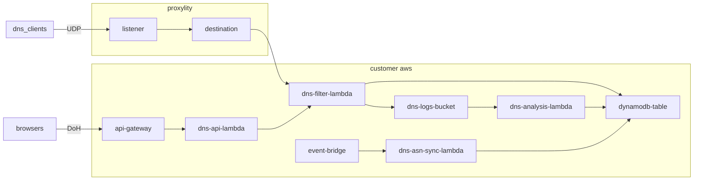

# MyDNS (aka. dns-filter)

MyDNS is a personal DNS service that can be run in your AWS account and provides UDP and DNS over HTTPS (DoH) endpoints. DoH is optional, and if enabled requires a registered domain name and hosted zone(see below). MyDNS can block (NXDOMAIN responses) and redirect (override the IP) both domain names and Autonomous Systems (by ASN). And, optionally (enabled by default) also logs DNS queries and performs analysis looking for suspicious activity. MyDNS is entirely serverless, but does require a subscription to Proxylity UDP Gateway.

## Why?

This project is motivated by some simple realities:

* DNS is a foundational service required to use the internet effectively
* DNS filtering is a capability that protects users and networks from undesirable content, malfeasance, misuse and abuse. 
* Privacy concerns motivate avoiding using DNS services provided by ISPs and others who may collect DNS information to build user profiles and sell them to third parties.

## Features

My DNS can:

* Block domains by returning an "nonexistent domain" (NXDOMAIN) response when queries for them
* Redirect domains by returning a specified IP address (to a portal, for example) for matching queries
* Block or redirect IPs by Autonomous System Number (ASN) by examining upstream DNS responses and matching the IPs they return to ASNs.
* Support traditional UDP-based DNS that is used by most devices and operating systems
* Support DNS over HTTPS (DoH) for use in browsers ([RFC 8484](https://datatracker.ietf.org/doc/html/rfc8484))
* Proxy unmatched DNS requests to an upstream DNS service of your choice (default is 1.0.0.3).  The upstream DNS will see a public AWS IP address as the client rather than your own, enhancing privacy.
* Incur low usage-based costs (free when within the AWS and Proxylity free tiers). 

> **NOTE**: This service provides UDP-based DNS on a non-standard port (i.e. not port 53).  Unfortunately, Windows doesn't allow configuring DNS servers on an alternate port, so a network level configuration is required to use it (DNAT at the router).  On Linux, and hardware that supports it like Cisco (IOS/IOS-XE), `iptables` DNAT can be used to redirect traffic bound to port 53 to this service. Other network hardware like Juniper Mist and Palo Alto have UI and/or API based configuration methods to support it. Merkaki MX, it seems, it doesn't appear possible since it lacks DNAT support.

## Code

In this repository you'll find the following code:

* Scripts in [scripts](./scripts/) that automate the deployment of MyDNS into your AWS account
* CloudFormation templates to configure the [global](./templates/dns-filter-global.template.json) and [regional](./templates/dns-filter-region.template.json) AWS resources needed, including DynamoDB tables, API Gateways, Route53 Record Sets, Lambda Functions, EventBridge Rules, and IAM Roles and Policies.
* C# code for the [DNS handler](./src/dns-filter-lambda/), [DoH handler](./src/dns-api-adapter-lambda/), [Query Log Analysis](./src/dns-analysis-lambda/) and [ASN Data processing](./src/dns-asn-data-lambda/) Lambda functions that make up the core of the system.

When logging is configured, the log messages (which are very minimal and don't include client IP addresses) are kept in the region that handles the DNS request. The analysis Lambda function runs in the same region and works asynchronously on batches of query log messages for efficiency, making calculatoions on individual queries (stateless analysis) as well as keeping track of statistics for base domains (stateful analysis). 

The number of "non-existent domain" (aka. NXDOMAIN) responses, the total number of queries, and unique number of subdomains are tracked in the global DDB table across all regional stacks.

When new suspicious domains are identified, an event is sent to the default EventBridge with the following format:

```json
{
    "DetailType": "suspicious-domain",
    "Detail": {
        "Domain": "somedomain.tld",
        "TotalQueries": 0,
        "NxDomainCount": 0,
        "Reasons": [ "<Reason 1>", ... ]
    },
    "Source": "dns-filter"
}
```

## System Diagram



## Deploying

> **NOTE**: The account in which you deploy MyDNS **must be subscribed to Proxylity UDP Gateay**, which is available in [AWS Marketplace]().  Subscribing is free and you will only be billed for Listeners you create and traffic delivered to Destinations you configure.  For personal use it is likely that MyDNS will operate within the AWS and Proxylity free tiers. For more information see [proxylity.com](https://proxylity.com/landing/love.html).

> **NOTE**: The instructions below assume the `aws` CLI, `jq` and [`dnsstress`](https://mickaelbergem.github.io/dnsstresss/) are available on your Linux system (WSL 2 works fine). 

### Configuration
Deployment easy using the provided bash scripts, but before using them you'll need to make some changes to it to match your AWS account environment.

Open the file `scripts/configure.sh` and make the following edits in the `CONFIGURATION` section:

* Change `DEPLOY_BUCKET_NAME_PREFIX` to match the prefix of buckets in your account. In each region in `DEPLOY_TO_REGIONS`, a bucket with the name `${DEPLOY_BUCKET_NAME_PREFIX}-${REGION}` must exist. Those buckets will be used to hold deployment artifacts (templates and the compiled lambda function archive). The script `scripts/prerequisites.sh` will help you identify any existing buckets that fit the bill, or to create new ones if none exist.

Additionally, the following optional changes may also be made:

* Optionally, change `DEPLOY_BUCKET_PATH_PREFIX` to change the location of the uploaded deployment artifacts.
* Optionally, change `STACK_NAME` to specify the name of the regional stacks (they will have the same name in each region). Note that the global stack will be created with the name `${STACK_NAME}-global`.
* Optionally, change `DNS_LOG_RETENTION` to specify the number of days DNS query logs should be retained.  Setting this variable to `0` will disable query logging entirely.

### Deployment

Once those changes are made, make sure the `AWS_REGION` variable is set and names the region where you'd like the global template to be created. Then, from the `examples/dns-folder` run the deploy script: 

```bash
./scripts/deploy.sh
```

For example, if you have a Route53 hosted zone for the base domain `yourdomain.tld` and want to use a custom dowmain name for the DoH endpoint with a subdomain called `doh`, the values can be supplied directly to the script:

```bash
AWS_REGION=us-west-2 DOMAIN_NAME=doh.yourbasedomain.tld HOSTED_ZONE_ID=<your_hosted_zone_id> DNS_LOG_RETENTION=7 ./scripts/deploy.sh 
```

The script will run through deploying the `templates/dns-filter-global.template.json` to the region identified by `AWS_REGION` and then deploy `templates/dns-filter-region.template.json` to each region identified in `DEPLOY_TO_REGIONS` in the script (us-west-2, us-east-1 and eu-west-1). 

Once the script is completed, your new UDP endpoint for DNS and the name of the DynamoDB table for configuring it can be found in `global-stack-outputs.json`. Extracting some of the values to environment variables makes testing easier:

```bash
export DNS_DOMAIN=$(jq -r .Domain global-stack-outputs.json)
export DNS_PORT=$(jq -r .Port global-stack-outputs.json)
export DNS_ENDPOINT=$(jq -r .Endpoint global-stack-outputs.json)
export DNS_TABLE=$(jq -r .TableName global-stack-outputs.json)
```

## Testing

To test DNS over HTTPS in your browser, you'll want to navigate to the security setting page and enable "Use Secure DNS".  Enter the full domain of the endpoint, including the scheme `https://` and the path `/dns-query`. 

No blocked or redirected domains or ASNs will be present in the table at this point, but a script to load some domains is provided. It will load the [pro mini](https://raw.githubusercontent.com/hagezi/dns-blocklists/main/wildcard/pro.mini-onlydomains.txt) version from [github.com/hagezi/dns-blocklists](https://github.com/hagezi/dns-blocklists), which will create ~65 thousand entries so be aware of the cost (it's also very slow, so cancel it with `ctrl-C` at any point to partially load the domains):

```bash
./scripts/load.sh
```

Use `nslookup` to verify the service is working as expected.  Looking up `google.com` should perform normally, whereas looking up `000free.us` should return the unroutable IP `0.0.0.0`:

```bash
$ nslookup -port=${DNS_PORT} google.com ${DNS_DOMAIN}
Server:         ingress-1.proxylity.com
Address:        15.197.76.92#2068

Non-authoritative answer:
Name:   google.com
Address: 142.251.33.110
Name:   google.com
Address: 2607:f8b0:400a:80a::200e
```
```bash
$ nslookup -port=${DNS_PORT} 000free.us ${DNS_DOMAIN}
Server:         ingress-1.proxylity.com
Address:        76.223.93.174#2068

Non-authoritative answer:
Name:   000free.us
Address: 0.0.0.0
Name:   000free.us
Address: 0.0.0.0
```

Additionally, if you have `dnsstress` installed, it can be used to demonstrate the robustness and scalability of UDP Gateway based DNS. However, be aware that this kind of load testing can produce significant costs over time. Here are a couple example runs:

```bash
$ go/bin/dnsstresss -concurrency 100 -r ${DNS_ENDPOINT} google.com
dnsstresss - dns stress tool

Testing resolver: ingress-1.proxylity.com:2068.
Target domains: [google.com.].

Started 100 threads.
Requests sent:     90r/s        Replies received:     90r/s (mean=177ms / max=334ms)
Requests sent:    340r/s        Replies received:    340r/s (mean=277ms / max=1184ms)
Requests sent:    400r/s        Replies received:    400r/s (mean=313ms / max=1254ms)
Requests sent:    500r/s        Replies received:    500r/s (mean=215ms / max=381ms)
...
```

Note that lookups of blocked domains are much faster due to caching:

```bash
$ go/bin/dnsstresss -concurrency 100 -r ${DNS_ENDPOINT} 000free.us
dnsstresss - dns stress tool

Testing resolver: ingress-1.proxylity.com:2068.
Target domains: [000free.us.].

Started 200 threads.
Requests sent:   1155r/s        Replies received:   1155r/s (mean=110ms / max=176ms)
Requests sent:   1855r/s        Replies received:   1855r/s (mean=109ms / max=212ms)
Requests sent:   1874r/s        Replies received:   1874r/s (mean=116ms / max=234ms)
Requests sent:   1730r/s        Replies received:   1730r/s (mean=118ms / max=212ms)
...
```

To remove the example stack:
```bash
./scripts/teardown.sh
```

## Using

* **To block a domain:**  
Add an item to the DDB table with the PK and SK both set to the domain name and the attribute `blocked` with a value of `true`. A domain can be a fully qualified domain name (FQDN) like www.example.com, a root domain like example.com (which blocks it and all subdomains) or even a top level domain like .io (which blocks any domain on that TLD).
```bash
aws dynamodn put-item --table-name ${DNS_TABLE} --item ...
```
* **To redirect domain:**  
Add a domain as above, but instead of setting the `blocked` attribute instead set the `redirect` attribute to the IP address that should be returned when that domain is requested.
```bash
aws dynamodn put-item --table-name ${DNS_TABLE} --item ...
```
* **To block an ASN:**  
Add an item to the DDB table with the PK and SK both set to `AS#{AsnNumber}` and the attribute `blocked` with a value of `true`. Any DNS lookup that returns an IP managed by that ASN will be rewritten to return the unroutable IP.
```bash
aws dynamodn put-item --table-name ${DNS_TABLE} --item ...
```
* **To redirect an ASN:**  
Add an item to the DDB table with the PK and SK both set to `AS#{AsnNumber}` and the attribute `redirect` attribute to the IP address that should be returned a lookup returns any IP operated by that ASN.
```bash
aws dynamodn put-item --table-name ${DNS_TABLE} --item ...
```

Initially, no domains or ASNs are present in the DB and all DNS requests are answered normally. See the deployment instructions below for how to bulk load a block list into the table.

## Roadmap

DNS Filtering is an important network service, and this example shows how to implement it in your own AWS account with little effort while providing full control over privacy, featuring scalability from zero to global demand, and excellent resiliency -- all at a fraction of the cost of alternatives. 

That said, some helpful capabilities are still missing from this project:

* An administrative UX to add, update and remove domains would be more convenient than using the AWS console or CLI.
* A dashboard presentation of DNS metrics, either built into the admin UX or a CloudWatch dashboard vreated as part of the deployment.

And, of course, this repo is open to pull requests!

