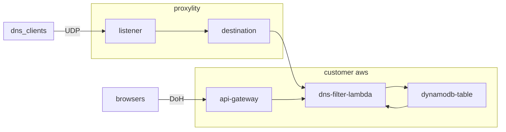

## Bespoke DNS with Filtering

This project is motivated by some simple realities around DNS:

* DNS is a foundational service that enables using the internet effectively
* DNS filtering is a capability that protects users and networks from undesirable content and certain kinds of malfeasance, misuse and abuse and is implemented on school and enterprise campuses, many places you may find guest/visitor Wi-Fi. 
* Privacy concerns motivate eschewing (avoiding) using DNS services provided by ISPs and others who may collect DNS information to build user profiles and sell them to third parties.

This example project provides a custom DNS serice with capabilities to:

* Block domains by returning an unroutable address like `0.0.0.0`
* Redirect domains by returning a specified IP address (to a portal, for example)
* Block or redirect IPs by Autonomous System Number (ASN)
* Support traditional UDP based DNS
* Support DNS over HTTPS (DoH) for use in browsers

> **NOTE**: This service provides UDP based DNS on a non-standard port (i.e. not port 53).  Unfortunately, Windows doesn't allow configuring DNS servers on an alternate port.  On Linux, and hardware that supports it like Cisco (IOS/IOS-XE), `iptables` DNAT can be used to redirect traffic bound to port 53 to this service. Other network hardware like Juniper Mist and Palo Alto have UI and/or API based configuration methods to support it. Merkaki MX, it seems, it doesn't appear possible since it lacks DNAT support.

This code demonstrates:

* Replying to UDP requests using AWS Lambda via Proxylity UDP Gateway.
* Deserialization and serialization of DNS queries and answers from packet data.
* Replying to HTTPS requests using the same Lambda via API Gateway with VTL request and response transforms.
* Deploying a capable, highly-scalable, resilient and very cost effective global DNS service. 

## System Diagram



## Deploying

> **NOTE**: The instructions below assume the `aws` CLI, `jq` and [`dnsstress`](https://mickaelbergem.github.io/dnsstresss/) are available on your Linux system (WSL 2 works fine). 

We've made deployment easy by providing a bash script, but you'll need to make some changes to it to match your AWS account environment.

Open the file `scripts/deploy.sh` and make the following edits in the `CONFIGURATION` section:

* Change `DEPLOY_BUCKET_NAME_PREFIX` to match the prefix of buckets in your account. In each region in `DEPLOY_TO_REGIONS`, a bucket with the name `${DEPLOY_BUCKET_NAME_PREFIX}-${REGION}` must exist. Those buckets will be used to hold deployment artifacts (templates and the compiled lambda function archive). 

The following optional changes may also be made:

* Optionally, change `DEPLOY_BUCKET_PATH_PREFIX` to change the location of the uploaded deployment artifacts.
* Optionally, change `DEPLOY_TO_REGIONS` to the set of regions you'd like to use.
* Optionally, change `STACK_NAME` to specify the name of the regional stacks (they will have the same name in each region). Note that the global stack will be created with the name `${STACK_NAME}-global`.

Once those changes are made, make sure the `AWS_REGION` variable is set and names the region where you'd like the global template to be created. Then, from the `examples/dns-folder` run the script: 

```bash
./scripts/deploy.sh
```

Or, if you have a Route53 hosted zone for the base domain and want to use a custom dowmain name for the DoH endpoint (probably a subdomain called `doh`), they can be supplied directly to the script:

```bash
AWS_REGION=us-west-2 DOMAIN_NAME=doh.yourbasedomain.tld HOSTED_ZONE_ID=<your_hosted_zone_id> ./scripts/deploy.sh 
```

The script will run through deploying the `templates/dns-filter-global.template.json` to the region identified by `AWS_REGION` and then deploy `templates/dns-filter-region.template.json` to each region identified in `DEPLOY_TO_REGIONS` in the script. 

Once the script is completed, your new DNS endpoint and the name of the DynamoDB table for configuring it can be found in `global-stack-outputs.json`. Extracting some of the values to environment variables makes testing easier:

```bash
export DNS_DOMAIN=$(jq -r .Domain global-stack-outputs.json)
export DNS_PORT=$(jq -r .Port global-stack-outputs.json)
export DNS_ENDPOINT=$(jq -r .Endpoint global-stack-outputs.json)
export DNS_TABLE=$(jq -r .TableName global-stack-outputs.json)
```

No blocked or redirected domains or ASNs will be present in the table at this point, but a script to load some domains is provided. It will load the [pro mini](https://raw.githubusercontent.com/hagezi/dns-blocklists/main/wildcard/pro.mini-onlydomains.txt) version from [github.com/hagezi/dns-blocklists](https://github.com/hagezi/dns-blocklists), which will create ~65 thousand entries so be aware of the cost (it's also very slow, so cancel it with `ctrl-C` at any point to partially load the domains):

```bash
./scripts/load.sh
```

Use `nslookup` to verify the service is working as expected.  Looking up `google.com` should perform normally, whereas looking up `000free.us` should return the unroutable IP `0.0.0.0`:

```bash
$ nslookup -port=${DNS_PORT} google.com ${DNS_DOMAIN}
Server:         ingress-1.proxylity.com
Address:        15.197.76.92#2068

Non-authoritative answer:
Name:   google.com
Address: 142.251.33.110
Name:   google.com
Address: 2607:f8b0:400a:80a::200e
```
```bash
$ nslookup -port=${DNS_PORT} 000free.us ${DNS_DOMAIN}
Server:         ingress-1.proxylity.com
Address:        76.223.93.174#2068

Non-authoritative answer:
Name:   000free.us
Address: 0.0.0.0
Name:   000free.us
Address: 0.0.0.0
```

Additionally, if you have `dnsstress` installed, it can be used to demonstrate the robustness and scalability of UDP Gateway based DNS. However, be aware that this kind of load testing can produce significant costs over time. Here are a couple example runs:

```bash
$ go/bin/dnsstresss -concurrency 100 -r ${DNS_ENDPOINT} google.com
dnsstresss - dns stress tool

Testing resolver: ingress-1.proxylity.com:2068.
Target domains: [google.com.].

Started 100 threads.
Requests sent:     90r/s        Replies received:     90r/s (mean=177ms / max=334ms)
Requests sent:    340r/s        Replies received:    340r/s (mean=277ms / max=1184ms)
Requests sent:    400r/s        Replies received:    400r/s (mean=313ms / max=1254ms)
Requests sent:    500r/s        Replies received:    500r/s (mean=215ms / max=381ms)
...
```

Note that lookups of blocked domains are much faster due to caching:

```bash
$ go/bin/dnsstresss -concurrency 100 -r ${DNS_ENDPOINT} 000free.us
dnsstresss - dns stress tool

Testing resolver: ingress-1.proxylity.com:2068.
Target domains: [000free.us.].

Started 200 threads.
Requests sent:   1155r/s        Replies received:   1155r/s (mean=110ms / max=176ms)
Requests sent:   1855r/s        Replies received:   1855r/s (mean=109ms / max=212ms)
Requests sent:   1874r/s        Replies received:   1874r/s (mean=116ms / max=234ms)
Requests sent:   1730r/s        Replies received:   1730r/s (mean=118ms / max=212ms)
...
```

To remove the example stack:
```bash
./scripts/teardown.sh
```

## Configuring

* **To block a domain:**  
Add an item to the DDB table with the PK and SK both set to the domain name and the attribute `blocked` with a value of `true`. A domain can be a fully qualified domain name (FQDN) like www.example.com, a root domain like example.com (which blocks it and all subdomains) or even a top level domain like .io (which blocks any domain on that TLD).
* **To redirect domain:**  
Add a domain as above, but instead of setting the `blocked` attribute instead set the `redirect` attribute to the IP address that should be returned when that domain is requested.
* **To block an ASN:**  
Add an item to the DDB table with the PK and SK both set to `AS#{AsnNumber}` and the attribute `blocked` with a value of `true`. Any DNS lookup that returns an IP managed by that ASN will be rewritten to return the unroutable IP.
* **To block an ASN:**  
Add an item to the DDB table with the PK and SK both set to `AS#{AsnNumber}` and the attribute `redirect` attribute to the IP address that should be returned a lookup returns any IP operated by that ASN.

Initially, no domains or ASNs are present in the DB and all DNS requests are answered normally. See the deployment instructions below for how to bulk load a block list into the table.

## About this Project

DNS Filtering is an important network service, and this example shows how to implement it in your own AWS account with little effort while providing full control over privacy, featuring scalability from zero to global demand, and excellent resiliency -- all at a fraction of the cost of alternatives.

