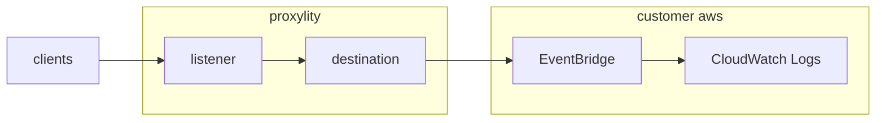

# EventBridge UDP Gateway Example

This example demonstrates how to receive UDP packets via Proxylity UDP Gateway and forward them to Amazon EventBridge. The template creates a UDP listener that sends inbound packets to the default EventBridge event bus, where they can be processed by rules and routed to various AWS services for further processing.

This example demonstrates:

* Using the Proxylity listener custom resource type for CloudFormation
* Configuring a destination to deliver UDP packets to EventBridge
* Setting up EventBridge rules to capture and process UDP packets
* Logging packet events to CloudWatch for monitoring and analysis

## System Diagram



## Deploying

> **NOTE**: The account in which you deploy this example **must be subscribed to Proxylity UDP Gateway**, which is available in [AWS Marketplace](). Subscribing is free and you will only be billed for Listeners you create and traffic delivered to Destinations you configure.

> **NOTE**: The instructions below assume the `aws` CLI, `jq` and `ncat` are available on your Linux system (WSL2 under Windows works great).

To deploy the template:

```bash
aws cloudformation deploy \
  --template-file template.json \
  --stack-name eventbridge-example \
  --capabilities CAPABILITY_IAM \
  --region us-west-2
```

Once deployed, the endpoint can be tested with `ncat` and the endpoint information provided in the outputs of the stack. To get the outputs from the stack and store the salient values in environment variables:

```bash
aws cloudformation describe-stacks \
  --stack-name eventbridge-example \
  --query "Stacks[0].Outputs" \
  --region us-west-2 \
  > outputs.json 

export UDP_DOMAIN=$(jq -r ".[]|select(.OutputKey==\"Domain\")|.OutputValue" outputs.json)
export UDP_PORT=$(jq -r ".[]|select(.OutputKey==\"Port\")|.OutputValue" outputs.json)
export PACKET_LOG_GROUP=$(jq -r ".[]|select(.OutputKey==\"PacketLogGroup\")|.OutputValue" outputs.json)
```

## Testing

To send a test packet to the EventBridge endpoint:

```bash
echo "Hello EventBridge!" | ncat -u ${UDP_DOMAIN} ${UDP_PORT}
```

You can verify that the packet was received and processed by checking the CloudWatch logs:

```bash
aws logs filter-log-events \
  --log-group-name ${PACKET_LOG_GROUP} \
  --query "events[].message" \
  --region us-west-2
```

The log entries will show the EventBridge events containing the UDP packet data. Each event includes:

* Source IP address and port of the sender
* Base64-encoded packet data
* Timestamp and other metadata

## EventBridge Integration

When UDP packets are received by the listener, they are automatically formatted as EventBridge events with the following structure:

```json
{
  "version": "0",
  "id": "event-id",
  "detail-type": "udp-gateway-packet-ingress",
  "source": "proxylity",
  "account": "123456789012",
  "time": "2025-09-29T12:34:56Z",
  "region": "us-west-2",
  "detail": {
    "Messages": [
      {
        "Tag": "unique-tag",
        "Remote": {
          "IpAddress": "192.168.1.100",
          "Port": 12345
        },
        "Data": "SGVsbG8gRXZlbnRCcmlkZ2Uh",
        "Timestamp": "2025-09-29T12:34:56.789Z"
      }
    ]
  }
}
```

### Adding Custom Processing

You can extend this example by adding additional EventBridge rules to process specific types of packets. For example, to create a rule that processes packets from a specific IP range:

```json
{
  "Rules": [
    {
      "Name": "ProcessInternalTraffic",
      "EventPattern": {
        "source": ["proxylity"],
        "detail-type": ["udp-gateway-packet-ingress"],
        "detail": {
          "Messages": {
            "Remote": {
              "IpAddress": [{"prefix": "10.0."}]
            }
          }
        }
      },
      "Targets": [
        {
          "Id": "InternalTrafficProcessor",
          "Arn": "arn:aws:lambda:us-west-2:123456789012:function:ProcessInternalTraffic"
        }
      ]
    }
  ]
}
```

## Configuration Options

The template includes the following configurable parameters:

### ClientCidrToAllow
* **Description**: The CIDR block describing which IP addresses should be allowed to use the listener
* **Default**: `0.0.0.0/0` (allows all IPs)
* **Example**: `10.0.0.0/8` to restrict to private network IPs only

### Batching Configuration
The destination is configured with batching settings to optimize delivery:
* **Count**: 11 packets per batch maximum
* **Timeout**: 0.5 seconds maximum wait time

You can modify these settings in the template to adjust for your specific use case.

## Monitoring and Logging

The example creates a CloudWatch log group `/aws/events/proxylity-udp-packets` with a 7-day retention period. All UDP packets delivered to EventBridge will be logged here for monitoring and debugging purposes.

To monitor packet delivery in real-time:

```bash
aws logs tail ${PACKET_LOG_GROUP} --follow --region us-west-2
```

## Use Cases

This EventBridge integration pattern is particularly useful for:

* **IoT Device Telemetry**: Collecting sensor data from UDP-enabled devices
* **Network Monitoring**: Processing network events and metrics
* **Game Server Analytics**: Capturing and analyzing real-time game events
* **Industrial Automation**: Handling industrial protocol messages
* **Distributed System Events**: Coordinating events across microservices

## Security Considerations

* **Network Access**: By default, the listener accepts packets from any IP address (`0.0.0.0/0`). Consider restricting this to known IP ranges in production
* **Data Encryption**: In this example UDP packets are transmitted in plain text. For sensitive data, A WireGuard (`Protocol`: `wg`) Listener can provide encryption "over the wire" 
* **Rate Limiting**: The batching configuration provides some natural rate limiting, but consider additional controls for high-volume scenarios

## Cleanup

To remove the example stack:

```bash
aws cloudformation delete-stack --stack-name eventbridge-example --region us-west-2
```

Note: The CloudWatch log group will be automatically deleted as part of the stack cleanup.

## Next Steps

* Explore adding Lambda functions as EventBridge targets for custom packet processing
* Implement EventBridge rules with more sophisticated event patterns
* Consider integrating with other AWS services like Step Functions, SQS, or SNS
* Add CloudWatch alarms for monitoring packet volume and processing errors

This example provides a foundation for building event-driven architectures that can process UDP traffic at scale using AWS's native event processing capabilities.
