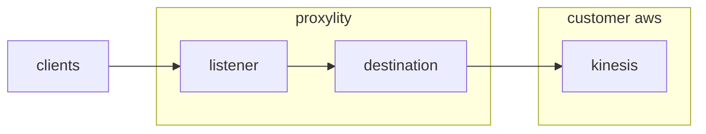

## Kinesis Data Streams

This example demonstrates directing UDP packets through Proxylity UDP Gateway to Amazon Kinesis Data Streams. A single destination is configured that delivers packets to a Kinesis stream and uses a dynamic partition key derived from the packet payload.

> NOTE: Kinesis Data Streams is a write-only Destination service, so no responses will be generated for inbound UDP packets in this example. To generate responses, add another Destination that supports request/response delivery like Lambda, StepFunctions or API Gateway.

This example demonstrates:

- Using the Proxylity listener custom resource type for CloudFormation.
- Writing packets to a Kinesis stream using `kinesis:PutRecords`.
- Configuring a dynamic partition key via `Arguments.PartitionKeyExpression` and `PartitionKeyFormatter`.

## System Diagram



## Deploying

> NOTE: The instructions below assume the `aws` CLI, `jq` and `ncat` are available on your Linux system.

To deploy the template:

```bash
aws cloudformation deploy \
  --template-file kinesis-streams.template.json \
  --stack-name kinesis-streams-example \
  --capabilities CAPABILITY_IAM \
  --region us-west-2
```

After deployment, retrieve the endpoint and stream information:

```bash
aws cloudformation describe-stacks \
  --stack-name kinesis-streams-example \
  --query "Stacks[0].Outputs" \
  --region us-west-2 \
  > outputs.json 

export KINESIS_DOMAIN=$(jq -r ".[]|select(.OutputKey==\"Domain\")|.OutputValue" outputs.json)
export KINESIS_PORT=$(jq -r ".[]|select(.OutputKey==\"Port\")|.OutputValue" outputs.json)
export STREAM_NAME=$(jq -r ".[]|select(.OutputKey==\"StreamName\")|.OutputValue" outputs.json)
```

Send a test UDP packet:

```bash
echo -ne "\x01\x02\x03\x04hello" | ncat -u ${KINESIS_DOMAIN} ${KINESIS_PORT}
```

The first 4 bytes (`0x01 0x02 0x03 0x04`) become the partition key (hex `01020304`) due to `PartitionKeyExpression: "[0:4]"` and `PartitionKeyFormatter: "hex"`.

### Verify records with AWS CLI

While Kinesis does not support a simple "receive" like SQS, you can confirm arrival by reading from the stream using a shard iterator. First, get the shard ID:

```bash
aws kinesis describe-stream-summary --stream-name ${STREAM_NAME} --region us-west-2
aws kinesis describe-stream --stream-name ${STREAM_NAME} --region us-west-2 > stream.json
export SHARD_ID=$(jq -r ".StreamDescription.Shards[0].ShardId" stream.json)
```

Create an iterator at the latest position and fetch records:

```bash
export ITERATOR=$(aws kinesis get-shard-iterator \
  --stream-name ${STREAM_NAME} \
  --shard-id ${SHARD_ID} \
  --shard-iterator-type LATEST \
  --region us-west-2 \
  --query 'ShardIterator' --output text)

aws kinesis get-records --shard-iterator ${ITERATOR} --region us-west-2 > records.json
cat records.json
```

You should see records containing the JSON packet object in the `Data` field (base64-encoded). To pretty-print the first record:

```bash
jq -r '.Records[0].Data' records.json | base64 -d | jq .
```

> NOTE: If no records are returned, wait a moment and repeat `get-records` with the same iterator or request a new iterator with `SHARD_ITERATOR_TYPE TRIM_HORIZON` to read from the oldest available records.

To remove the example stack:

```bash
aws cloudformation delete-stack --stack-name kinesis-streams-example --region us-west-2
```

## Kinesis Technical Details

Proxylity forwards packet data to Kinesis Data Streams using `PutRecords`. Each record contains a single JSON-encoded packet with full metadata.

### Dynamic Partition Key

- **Expression**: `[0:4]` extracts the first 4 bytes of the payload.
- **Formatter**: `hex` converts those bytes to a hex string.
- **Result**: Per-identifier ordering across shards; parallelism across different keys.

See the full docs: https://www.proxylity.com/docs/destinations/kinesis.html
