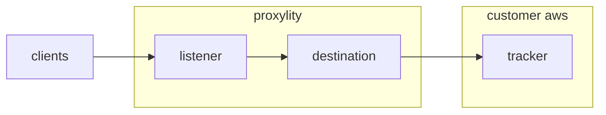

## Location Service 

This example demonstrates using AWS Location Service with Proxylity UDP Gateway to track locations encoded in UDP packets. This is a "no code" example that extracts the device ID, latitude, longitude, and custom properties from the packet data and uses the `BatchUpdateDevicePosition` API to record them.

This example demonstrates:

* Using the Proxylity listener custom resource type for CloudFormation.
* Using Binary Range EXpressions (BREX) to extract device ID, latitude and longitude data from packets.
* Adding user-defined position properties/metadata with values extracted with BREX. 
* Using the AWS Location Service integration to update device positions and metadata.

## System Diagram



## Deploying

> **NOTE**: The instructions below assume the `aws` CLI, `jq` and `ncat` are available on your Linux system. 

To deploy the template for the first time:

```bash
sam build & sam deploy --stack-name location-example --guided
```

Once deployed, updates to the stack can omit `--guided` if the `samconfig.toml` file was saved.  

To get the outputs from the stack and store the listener endpoint values in environment variables:

```bash
aws cloudformation describe-stacks \
  --stack-name location-example \
  --query "Stacks[0].Outputs" \
  --region us-west-2 \
  > outputs.json 

LOCATION_EXAMPLE_DOMAIN=$(jq -r ".[]|select(.OutputKey==\"Domain\")|.OutputValue" outputs.json)
LOCATION_EXAMPLE_PORT=$(jq -r ".[]|select(.OutputKey==\"Port\")|.OutputValue" outputs.json)
```

Then to send a single test packet:

```bash
echo -n -e "" > /dev/udp/
```

To remove the example stack:
```bash
sam delete
```

## Location Service Integration

Proxylity forwards packet data to the AWS Location Service per the [documented integrattion](https://proxylity.com/docs/destinations/location.html). 

No responses are generated by the integration, so using a Lambda or Step Functions destination alongside may be necessary if your client devices expect acknowlegements or responses.

The location tracker integration makes use of [Binary Range EXpressions](https://www.proxylity.com/docs/destinations/brex-syntax.html), which allow transforming binary data into the arguments needed for the Location API. The device ID, latitude and longitude expressions are required.