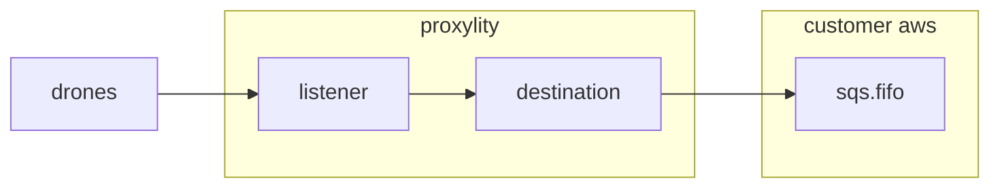

## MAVLINK v1 and v2 to FIFO SQS


> NOTE: SQS is a write-only Destination service, so no responses will be generated for inbound UDP packets in this example. To generate responses, add another Destination that supports request/response delivery like Lambda, StepFunctions or API Gateway.

This example demonstrates:

* Using the Proxylity listener custom resource type for CloudFormation.
* Configuring SQS delivery options (raw delivery, message attributes, `MessageGroupId`, `MessageDeduplicationId`).

## System Diagram



## Deploying

> **NOTE**: The instructions below assume the `aws` CLI, `jq` and `ncat` are available on your Linux system. 

To deploy the template:

```bash
aws cloudformation deploy \
  --template-file mavlink.template.json \
  --stack-name mavlink-example \
  --capabilities CAPABILITY_IAM \
  --region us-west-2
```

Once deployed, the endpoint can be tested with `ncat` and the endpoint information provided in the outputs of the stack. To get the ouputs from the stack and store the salient values in environment variables:

```bash
aws cloudformation describe-stacks \
  --stack-name mavlink-example \
  --query "Stacks[0].Outputs" \
  --region us-west-2 \
  > outputs.json

export MAVLINK_DOMAIN=$(jq -r ".[]|select(.OutputKey==\"Domain\")|.OutputValue" outputs.json)
export MAVLINK_PORT=$(jq -r ".[]|select(.OutputKey==\"Port\")|.OutputValue" outputs.json)
export MAVLINK_FIFO_QUEUE_URL=$(jq -r ".[]|select(.OutputKey==\"FifoQueueUrl\")|.OutputValue" outputs.json)
```

The scripts `send_heartbeat.py` and `poll_queue.py` can be used to send and display a sequence of MAVLINK message.  The scripts use the environment variable above.  First we'll send a series of messages (use ctrl-C to cancel after a few messages):

```bash
$ python send_heartbeat.py
Sending HEARTBEAT packets to ingress-1.proxylity.com:2141
Press Ctrl+C to exit

[21:00:34] v1 seq=  1: FE 09 00 A2 C2 00 06 08 40 00 00 00 00 04 03 97 83
[21:00:34] v2 seq=  1: FD 09 00 00 00 C2 E2 00 00 00 06 08 40 00 00 00 00 04 03 C4 4F
[21:00:35] v1 seq=  2: FE 09 01 A2 C2 00 06 08 40 00 00 00 00 04 03 97 83
[21:00:35] v2 seq=  2: FD 09 00 00 01 C2 E2 00 00 00 06 08 40 00 00 00 00 04 03 C4 4F
[21:00:36] v1 seq=  3: FE 09 02 A2 C2 00 06 08 40 00 00 00 00 04 03 97 83
[21:00:36] v2 seq=  3: FD 09 00 00 02 C2 E2 00 00 00 06 08 40 00 00 00 00 04 03 C4 4F
[21:00:37] v1 seq=  4: FE 09 03 A2 C2 00 06 08 40 00 00 00 00 04 03 97 83
[21:00:37] v2 seq=  4: FD 09 00 00 03 C2 E2 00 00 00 06 08 40 00 00 00 00 04 03 C4 4F
^C
Exiting...
```

Next we can retrieve the messages from the queue:
```bash
$ python poll_queue.py
Polling queue: https://sqs.us-west-2.amazonaws.com/123456789012/mavlink-example-FifoQueue-81Td8F7YYd7o.fifo
Press Ctrl+C to exit

[21:00:35] {'MessageId': '6d412cf3-7350-4b6a-ab7c-a8e7efd1ebf8', 'ReceiptHandle': 'AQE...scGJy', 'MD5OfBody': 'b88dd1dee98fd352a7fdbee9376869a2', 'Body': 'FE0900A2C2000608400000000004039783', 'Attributes': {'SenderId': 'AROAUNMMZ633YVRTCH4UO:proxylity-us-west-2@123456789012-dstn-mavlink-example-UdpListene', 'ApproximateFirstReceiveTimestamp': '1763960435260', 'ApproximateReceiveCount': '1', 'SentTimestamp': '1763960435260', 'SequenceNumber': '18898317945136111872', 'MessageDeduplicationId': 'c529ae08e940430683e1c67dbed8ef1b', 'MessageGroupId': 'A2C2'}, 'MD5OfMessageAttributes': '68224a3f262799dab0affabb81b25b3c', 'MessageAttributes': {'LocalDomain': {'StringValue': 'ingress-1', 'DataType': 'String'}, 'LocalPort': {'StringValue': '2141', 'DataType': 'Number'}, 'RemoteAddress': {'StringValue': '1.2.3.4', 'DataType': 'String'}, 'RemotePort': {'StringValue': '45778', 'DataType': 'Number'}}}

[21:00:35] {'MessageId': '325f1e91-ab8e-4449-8781-28d73204f2af', 'ReceiptHandle': 'AQE...8pgir', 'MD5OfBody': '4e852eb20804eef775fa72401f1f1134', 'Body': 'FD09000000C2E2000000060840000000000403C44F', 'Attributes': {'SenderId': 'AROAUNMMZ633YVRTCH4UO:proxylity-us-west-2@123456789012-dstn-mavlink-example-UdpListene', 'ApproximateFirstReceiveTimestamp': '1763960435346', 'ApproximateReceiveCount': '1', 'SentTimestamp': '1763960435275', 'SequenceNumber': '18898317945139951872', 'MessageDeduplicationId': '0459c7b22fa742cc9ce0878c18aa7a52', 'MessageGroupId': 'C2E2'}, 'MD5OfMessageAttributes': 'd25352f0282252780ba6269ac485b1f3', 'MessageAttributes': {'LocalDomain': {'StringValue': 'ingress-1', 'DataType': 'String'}, 'LocalPort': {'StringValue': '2141', 'DataType': 'Number'}, 'RemoteAddress': {'StringValue': '1.2.3.4', 'DataType': 'String'}, 'RemotePort': {'StringValue': '58785', 'DataType': 'Number'}}}

[21:00:36] {'MessageId': 'a26ca757-a5f5-4943-88a6-eeb80f480d55', 'ReceiptHandle': 'AQE...k1bDv', 'MD5OfBody': 'f9662925e5b69c0b0bc74114ea8d6c91', 'Body': 'FE0901A2C2000608400000000004039783', 'Attributes': {'SenderId': 'AROAUNMMZ633YVRTCH4UO:proxylity-us-west-2@123456789012-dstn-mavlink-example-UdpListene', 'ApproximateFirstReceiveTimestamp': '1763960436265', 'ApproximateReceiveCount': '1', 'SentTimestamp': '1763960436265', 'SequenceNumber': '18898317945393391616', 'MessageDeduplicationId': '6917ca77cd784f4bbee24638845b603f', 'MessageGroupId': 'A2C2'}, 'MD5OfMessageAttributes': '68224a3f262799dab0affabb81b25b3c', 'MessageAttributes': {'LocalDomain': {'StringValue': 'ingress-1', 'DataType': 'String'}, 'LocalPort': {'StringValue': '2141', 'DataType': 'Number'}, 'RemoteAddress': {'StringValue': '1.2.3.4', 'DataType': 'String'}, 'RemotePort': {'StringValue': '45778', 'DataType': 'Number'}}}

[21:00:36] {'MessageId': '5232d1ba-110b-45e3-9f5a-0c324abafa66', 'ReceiptHandle': 'AQE...3ZMXF', 'MD5OfBody': 'c08732d9d46c5ed5d1669a79fc997e32', 'Body': 'FD09000001C2E2000000060840000000000403C44F', 'Attributes': {'SenderId': 'AROAUNMMZ633YVRTCH4UO:proxylity-us-west-2@123456789012-dstn-mavlink-example-UdpListene', 'ApproximateFirstReceiveTimestamp': '1763960436325', 'ApproximateReceiveCount': '1', 'SentTimestamp': '1763960436265', 'SequenceNumber': '18898317945393391617', 'MessageDeduplicationId': '6fcd628f56f048cebe91b10e7cfa4bd9', 'MessageGroupId': 'C2E2'}, 'MD5OfMessageAttributes': 'd25352f0282252780ba6269ac485b1f3', 'MessageAttributes': {'LocalDomain': {'StringValue': 'ingress-1', 'DataType': 'String'}, 'LocalPort': {'StringValue': '2141', 'DataType': 'Number'}, 'RemoteAddress': {'StringValue': '1.2.3.4', 'DataType': 'String'}, 'RemotePort': {'StringValue': '58785', 'DataType': 'Number'}}}
```

You can see that the correct message body is present, and group ID is extracted from each type of packet according to the STX byte (i.e. version).  Each message contains a random deduplication value, and metadata from the packet has been populated in the SQS message attributes since sending raw data is configured in the template.

To remove the example stack:
```bash
aws cloudformation delete-stack --stack-name sqs-example --region us-west-2
```

## MAVLINK Technical Details

### MAVLink Protocol

[MAVLink](https://mavlink.io/) is a lightweight messaging protocol designed for communication with drones and unmanned vehicles. It operates over UDP and supports two versions with different packet structures:

**MAVLink v1** packets start with STX byte `0xFE`:
- Bytes 0-5: Header (STX, Length, Sequence, System ID, Component ID, Message ID)
- Variable payload based on message type
- 2-byte CRC checksum

**MAVLink v2** packets start with STX byte `0xFD`:
- Bytes 0-9: Header (STX, Length, Flags, Sequence, System ID, Component ID, 24-bit Message ID)
- Variable payload
- 2-byte CRC checksum (plus optional signature)

Each drone is identified by its System ID (SYSID) and Component ID (COMPID). Messages like HEARTBEAT are sent periodically (typically once per second) with an incrementing sequence number that rolls over after 255.

### Using FIFO Queues with MAVLink

FIFO queues provide ordered message delivery, which is ideal for protocols like MAVLink where message sequence matters. However, FIFO queues have special requirements:

**Message Group IDs** - Required for FIFO queues. Messages within the same group are processed in order, one at a time. For MAVLink, we want one group per drone to maintain per-drone ordering while allowing parallel processing across drones.

The template uses this expression to extract SYSID and COMPID:
```
[0] = 0xFE ? [3:5] : ([0] = 0xFD ? [5:7] : 0xFFFF)
```
This checks the STX byte to determine version, then extracts the 2-byte SYSID+COMPID combination, creating a unique group per drone.

**Message Deduplication** - FIFO queues deduplicate messages within a 5-minute window. Deduplication can be:
- **Content-based** (default): Hash of message body is used as deduplication ID
- **Explicit**: Set a custom `MessageDeduplicationId` per message

For MAVLink HEARTBEAT messages, content-based deduplication would be problematic since the payload is often identical across messages, only the sequence number changes. With the sequence rolling over every 256 messages (~4 minutes), duplicate detection would drop legitimate messages.

**Solution**: When no `MessageDeduplicationIdExpression` is configured, UDP Gateway automatically generates random deduplication IDs for each message. This effectively disables deduplication while still meeting the FIFO queue requirement. Every message is delivered, maintaining the complete sequence of heartbeats and status updates.

### Summary

Integrating MAVLink with SQS FIFO queues demonstrates the flexibility of UDP Gateway's range expressions:
- Dynamic message routing based on packet version (v1 vs v2)
- Per-drone message ordering via extracted identifiers
- Controlled deduplication behavior for time-series telemetry data

This configuration enables reliable, ordered delivery of drone telemetry at scale without message loss. 

