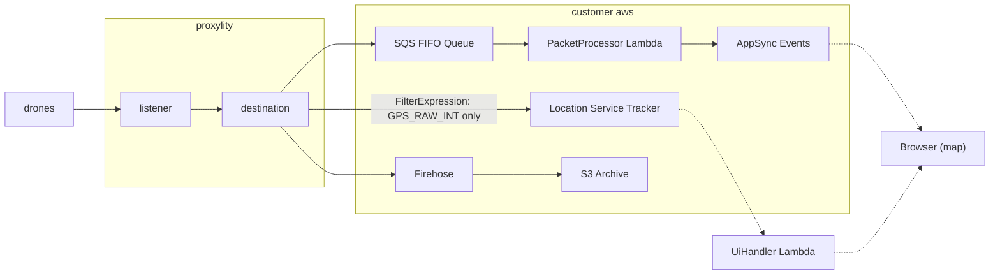

## MAVLink Drone Fleet Tracking

This example tracks a fleet of drones in real time using [MAVLink](https://mavlink.io/) telemetry over UDP. A single Proxylity listener fans out every packet to three AWS services simultaneously -- each with a distinct purpose:

1. **Location Service Tracker** -- stores clean GPS position traces per drone, extracted directly from binary MAVLink packets using BREX expressions. No Lambda, no application code.
2. **SQS FIFO Queue** -- orders and partitions the packet stream per drone. A Lambda function decodes GPS data and publishes position events to an AppSync Events channel for real-time browser display.
3. **Firehose to S3** -- archives every raw packet for durable storage and potential batch processing.

A Python simulator sends a realistic mix of MAVLink v2 messages (HEARTBEAT, SYS_STATUS, GPS_RAW_INT, ATTITUDE), and a browser-based map shows the drones moving in real time. The map is served by a Lambda URL -- open the link and it just works, no configuration required.

This example demonstrates:

* Three-way composite destinations -- one listener delivering to Location Service, SQS FIFO, and Firehose simultaneously.
* `FilterExpression` for per-destination packet filtering -- the Location Service destination only receives GPS_RAW_INT packets; other message types are silently dropped.
* AWS Location Service integration with BREX for extracting device ID, latitude, longitude, and metadata from binary packets.
* Real-time browser push via [AppSync Events](https://docs.aws.amazon.com/appsync/latest/eventapi/event-api-welcome.html) -- no polling.
* SQS FIFO with per-drone message ordering via `MessageGroupId` extracted from the MAVLink SYSID+COMPID fields.
* Firehose to S3 for raw packet archival with zero code.
* `ScaleFactor` for converting MAVLink degE7 integer coordinates to decimal degrees.
* `PositionPropertyExpressions` for attaching altitude, groundspeed, and satellite count to each tracked position.

## System Diagram



## Deploying

> **NOTE**: The instructions below assume the `aws` CLI, SAM CLI, and `jq` are available on your system.

Build and deploy:

```bash
sam build && sam deploy --stack-name mavlink-example --guided
```

Once deployed, updates to the stack can omit `--guided` if the `samconfig.toml` file was saved.

Extract the stack outputs into environment variables:

```bash
aws cloudformation describe-stacks \
  --stack-name mavlink-example \
  --query "Stacks[0].Outputs" \
  --region us-west-2 \
  > outputs.json

export MAVLINK_DOMAIN=$(jq -r '.[]|select(.OutputKey=="Domain")|.OutputValue' outputs.json)
export MAVLINK_PORT=$(jq -r '.[]|select(.OutputKey=="Port")|.OutputValue' outputs.json)
export LIVE_UI_URL=$(jq -r '.[]|select(.OutputKey=="LiveUiUrl")|.OutputValue' outputs.json)
```

## Running the Simulator

The `send_flight.py` script simulates a fleet of drones flying circular paths around a center point. It is pure Python with zero external dependencies -- it builds MAVLink v2 packets from scratch using `struct.pack` and a built-in X.25 CRC implementation.

```bash
python send_flight.py
```

The script reads `MAVLINK_DOMAIN` and `MAVLINK_PORT` from the environment variables set above. By default it simulates 3 drones orbiting Pendleton, OR (UAV test range) at different altitudes and speeds:

```
Simulating 3 drones around 45.6951, -118.8434 (radius 500m)
Sending GPS_RAW_INT to ingress-1.proxylity.com:2141
Press Ctrl+C to exit

[14:23:01] Drone 01:C2 | lat=45.51630 lon=-122.67710 alt=120m vel=12.0m/s sats=14
[14:23:01] Drone 02:C2 | lat=45.51410 lon=-122.67970 alt= 80m vel= 8.0m/s sats=13
[14:23:01] Drone 03:C2 | lat=45.51480 lon=-122.67620 alt=150m vel=15.0m/s sats=12
[14:23:02] Drone 01:C2 | lat=45.51628 lon=-122.67704 alt=120m vel=12.0m/s sats=15
...
```

Options:

| Flag | Default | Description |
|------|---------|-------------|
| `--drones N` | 3 | Number of drones in the fleet |
| `--center LAT,LON` | 45.6951,-118.8434 | Orbit center point |
| `--radius M` | 500 | Orbit radius in meters |
| `--domain HOST` | env `MAVLINK_DOMAIN` | UDP destination host |
| `--port PORT` | env `MAVLINK_PORT` | UDP destination port |

Each drone sends four MAVLink v2 messages per tick: HEARTBEAT (msg 0), SYS_STATUS (msg 1), GPS_RAW_INT (msg 24), and ATTITUDE (msg 30). The `FilterExpression` on the Location Service destination passes only GPS_RAW_INT -- the other three message types are silently dropped. The SQS FIFO and Firehose destinations receive all four, so the archive captures the complete telemetry stream. Battery voltage drains realistically over time, and attitude angles reflect the circular flight path.

## Viewing the Map

Open the `LiveUiUrl` stack output in a browser. That's it.

```bash
echo "Open this URL in your browser: ${LIVE_UI_URL}"
```

The page loads with current drone positions pre-populated from the Location Service tracker history. As the simulator runs, new positions stream in via WebSocket through AppSync Events -- no polling, no configuration, no credentials to enter.

What you'll see:

- **Colored markers** for each drone with device ID labels (e.g. `01C2`)
- **Trailing paths** showing where each drone has been
- **Click any marker** to see altitude, speed, satellite count, and last update time
- **Status bar** showing drone count and connection status

Multiple browser tabs see the same stream simultaneously.

## How It Works

The template configures a single Proxylity listener with three composite destinations. Each destination serves a different purpose and can operate independently.

### Destination 1: Location Service Tracker

The Location Service destination uses a `FilterExpression` to accept only MAVLink v2 GPS_RAW_INT packets (message ID 24). All other message types are silently dropped before delivery. Packets that pass the filter have their fields extracted by BREX expressions and written to the tracker via `BatchUpdateDevicePosition` -- no Lambda or application code involved.

### Destination 2: SQS FIFO -> Lambda -> AppSync Events

The SQS FIFO destination receives all packets with per-drone ordering. A Lambda function (`PacketProcessor`) is triggered by SQS, decodes GPS_RAW_INT payloads, and publishes structured position events to an AppSync Events channel. The browser subscribes to this channel over WebSocket for real-time updates.

### Destination 3: Firehose to S3

The Firehose destination archives every raw packet to S3 in hex format. This provides durable storage for replay, compliance, or batch analytics -- with zero code.

### MAVLink v2 Packet Layout

| Byte | Field | Size |
|------|-------|------|
| 0 | STX (`0xFD`) | 1 |
| 1 | Payload length | 1 |
| 2 | Incompatibility flags | 1 |
| 3 | Compatibility flags | 1 |
| 4 | Sequence number | 1 |
| 5 | System ID (SYSID) | 1 |
| 6 | Component ID (COMPID) | 1 |
| 7-9 | Message ID (24-bit LE) | 3 |
| 10+ | Payload | N |
| 10+N | CRC-16 (X.25) | 2 |

### GPS_RAW_INT Payload (Message ID 24)

Fields are serialized in MAVLink wire order (largest type first):

| Payload Offset | Packet Offset | Size | Type | Field | Units |
|----------------|---------------|------|------|-------|-------|
| 0 | 10 | 8 | uint64 | time_usec | microseconds |
| 8 | 18 | 4 | int32 | lat | degE7 |
| 12 | 22 | 4 | int32 | lon | degE7 |
| 16 | 26 | 4 | int32 | alt | mm (MSL) |
| 20 | 30 | 2 | uint16 | eph | cm |
| 22 | 32 | 2 | uint16 | epv | cm |
| 24 | 34 | 2 | uint16 | vel | cm/s |
| 26 | 36 | 2 | uint16 | cog | cdeg |
| 28 | 38 | 1 | uint8 | fix_type | enum |
| 29 | 39 | 1 | uint8 | satellites_visible | count |

### Location Service -- FilterExpression and BREX

The Location Service destination first filters, then extracts fields from each matching packet:

```jsonc
// Only deliver MAVLink v2 packets with message ID 24 (GPS_RAW_INT).
// Byte 0 is the STX marker (0xFD = v2), bytes 7-9 are the 24-bit LE message ID.
// Packets that don't match (HEARTBEAT, SYS_STATUS, etc.) are silently dropped.
"FilterExpression": "[0] == 0xFD && [7] == 0x18 && [8] == 0x00 && [9] == 0x00",

// Fields extracted from packets that pass the filter:
"Arguments": {
  // Device ID: SYSID + COMPID from the v2 header, rendered as hex (e.g. "01C2")
  "DeviceIdExpression": "[5:7]",

  // Latitude: int32 LE at packet offset 18 (payload offset 8)
  "LatitudeExpression": "i32le[18:22]",

  // Longitude: int32 LE at packet offset 22 (payload offset 12)
  "LongitudeExpression": "i32le[22:26]",

  // MAVLink transmits coordinates as degE7 (degrees * 10^7).
  // ScaleFactor converts the extracted integer to decimal degrees.
  "ScaleFactor": 0.0000001,

  // Up to 3 user-defined position properties:
  "PositionPropertyExpressions": {
    "alt_mm": "i32le[26:30]",     // altitude in millimeters (packet offset 26)
    "vel_cms": "u16le[34:36]",    // groundspeed in cm/s (packet offset 34)
    "satellites": "u8[39]"        // visible satellites (packet offset 39)
  }
}
```

`ScaleFactor` is the key to making the Location Service path work without code. MAVLink encodes 45.6951 degrees as the integer `456951000`. Multiplying by `0.0000001` recovers the decimal degrees that the Location Service API expects.

### SQS FIFO -- Per-Drone Ordering

The FIFO destination uses a conditional BREX expression to extract the `MessageGroupId`, adapting for the different header layouts in MAVLink v1 and v2:

```
[0] == 0xFE ? [3:5] : ([0] == 0xFD ? [5:7] : 0xFFFF)
```

This checks the STX byte to determine the protocol version, then extracts the 2-byte SYSID+COMPID from the correct header offset. Messages from the same drone are grouped together, so SQS delivers them in order. Messages from different drones can be processed in parallel.

The `PacketProcessor` Lambda is triggered by the SQS event source mapping with a batch size of 10. It decodes GPS_RAW_INT payloads and publishes position events to the `/drones/positions` AppSync Events channel. The browser receives these events instantly over WebSocket.

### UiHandler -- Pre-Populated Map

When a browser opens the `LiveUiUrl`, the `UiHandler` Lambda:

1. Calls `ListDevicePositions` on the Location Service tracker to get the latest position of every drone.
2. Embeds the results as `window.__INITIAL_POSITIONS` in the HTML.
3. Returns the complete page with AppSync connection details baked in.

The browser renders the initial positions immediately, then connects to AppSync Events for live updates. This means drones appear on the map even if the simulator has been running for a while before the browser opens.

## Project Structure

```
mavlink/
|-- template.json         CloudFormation (3 destinations + AppSync + Lambdas)
|-- src/
|   |-- packet-processor/         Lambda: decode MAVLink, publish to AppSync Events
|   |   +-- packet_processor.py
|   +-- ui-handler/               Lambda: serve map HTML via Lambda URL
|       +-- ui_handler.py
|-- send_flight.py                Pure Python flight simulator (zero deps)
+-- readme.md
```

## Cleanup

To remove all resources created by this example:

```bash
sam delete
```

> **NOTE**: The S3 archive bucket must be empty before the stack can be deleted. Either empty it manually or add a `DeletionPolicy: Delete` with a custom resource to handle cleanup.

## MAVLink Protocol Reference

[MAVLink](https://mavlink.io/) is a lightweight messaging protocol for communication with drones and unmanned vehicles. It operates over UDP and supports two versions:

- **MAVLink v1** -- 8-byte header starting with STX `0xFE`. System ID at byte 3, Component ID at byte 4, 8-bit message ID at byte 5.
- **MAVLink v2** -- 12-byte header starting with STX `0xFD`. System ID at byte 5, Component ID at byte 6, 24-bit message ID at bytes 7-9.

Each message type has a **CRC_EXTRA** seed byte that is folded into the CRC-16 checksum. This prevents version mismatches -- a receiver that expects a different message definition will reject the packet. GPS_RAW_INT (message ID 24) has CRC_EXTRA = 24.

Coordinates in GPS_RAW_INT are encoded as **degE7** -- signed 32-bit integers representing degrees multiplied by 10^7. This gives sub-centimeter precision in a compact 4-byte field. For example, latitude 45.6951 is transmitted as `456951000`.

For the full message definitions, see the [MAVLink Common Message Set](https://mavlink.io/en/messages/common.html).
