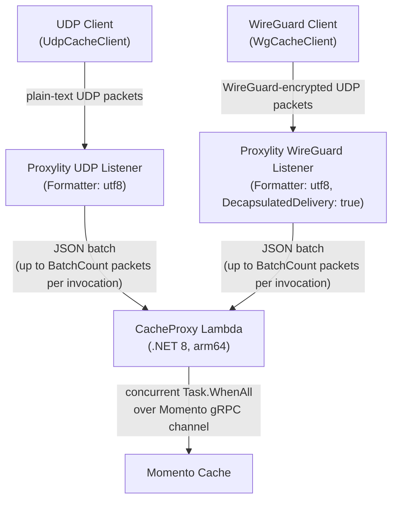

# Momento UDP Cache Proxy

A low-latency UDP caching service that exposes [Momento](https://www.gomomento.com/) cache operations over UDP via the [Proxylity](https://proxylity.com/) UDP-to-Lambda gateway. Clients send fire-and-forget UDP packets; Proxylity batches them into Lambda invocations; the Lambda fans them out as concurrent Momento gRPC calls and returns the results.


## The Redesign: From gRPC to UDP

The Momento SDK exposes a gRPC-backed async API. A standard client call looks like this:

```csharp
// gRPC SDK — caller owns the channel lifecycle
using var client = new CacheClient(
    Configurations.Laptop.Latest(),
    new EnvMomentoV2TokenProvider("MOMENTO_API_KEY"),
    defaultTtl: TimeSpan.FromSeconds(300));

CacheGetResponse response = await client.GetAsync("my-cache", "my-key");
if (response is CacheGetResponse.Hit hit)
    Console.WriteLine(hit.ValueString);
```

The SDK manages a gRPC channel: TCP connection, TLS negotiation, HTTP/2 SETTINGS frame, and keep-alive pings. The application owns the `CacheClient` lifetime; dropping it tears down the connection. Reconnection, backpressure, and request correlation all propagate through the HTTP/2 stream layer.

The UDP equivalent:

```csharp
// UDP SDK — no connection, no lifetime to manage
await using var client = new UdpCacheClient("your-proxylity-host", port);

GetResult result = await client.GetAsync("my-key");
if (result.Hit)
    Console.WriteLine(result.ValueAsString);
```

The client sends a single UDP datagram. There is no connection to establish, no state to maintain, and no session lifetime to manage beyond the socket. The transport is replaced entirely; the `async`/`await` surface is preserved. The complexity that was in the client — channel management, stream multiplexing, reconnection — moves to the Lambda, where it belongs on the server side of the edge.


## Why UDP on the client side?

Cache operations are **inherently loss-tolerant**: a dropped packet is just a cache miss, which the caller handles by falling back to the authoritative source. No data integrity is at risk. This property makes UDP an unusually good fit.

Beyond loss tolerance, the edge-to-cloud path — public internet, Wi-Fi, mobile — is where TCP's reliability guarantees become a liability rather than an asset:

- **Head-of-line blocking.** When TCP loses a packet its retransmission timer (typically 200 ms–1 s) stalls *every* request on that connection. Because each UDP datagram is independent, a dropped packet affects only that single operation; all others proceed without interruption. This keeps P99 latency bounded by the application timeout, not the OS retransmission schedule.
- **Connection overhead.** A gRPC client must complete a TCP + TLS + HTTP/2 handshake before the first request. UDP clients fire immediately with no state to establish or maintain. This matters especially for serverless functions, mobile clients, and IoT devices that invoke the cache infrequently.
- **Connection state to manage.** Reconnection logic, backpressure, and keep-alives are the caller's problem with long-lived connections. UDP clients are stateless.

### Why gRPC on the backend?

Lambda → Momento is server-to-server, in-region, low jitter, and highly reliable. Those are exactly the conditions where gRPC's connection overhead amortises well and its congestion control is a virtue rather than a source of latency. The persistent `CacheClient` channel survives across warm Lambda invocations, so the handshake cost is paid once.

### The Proxylity batching multiplier

Proxylity groups up to `BatchCount` UDP datagrams from many independent clients into a single Lambda invocation. The Lambda then fans all of them out *concurrently* over one gRPC channel via `Task.WhenAll`. Clients therefore benefit from connection multiplexing without needing to know it exists — the complexity lives entirely inside the Lambda.

### WireGuard: encrypted UDP without falling back to TCP

Plain UDP is unencrypted and unauthenticated. The conventional answer for securing UDP traffic is DTLS — but DTLS inherits much of TLS's handshake overhead and is complex to implement correctly. An alternative is to keep running plain UDP inside a WireGuard tunnel.

WireGuard is a modern VPN protocol built entirely on UDP. It provides mutual authentication and encryption with a minimal handshake (one round trip for a fresh session, then stateless from the client's perspective). Critically, it does *not* introduce a TCP layer: the outer transport remains UDP, so all the latency properties described above are preserved.

`WgCacheClient` is a drop-in replacement for `UdpCacheClient`. Both derive from `CacheClientBase` and share the same wire protocol; the only difference is the transport layer. The Lambda receives identical UTF-8 payloads either way because Proxylity's WireGuard Listener is configured with `DecapsulatedDelivery: true` — it strips the WireGuard envelope before invoking the Lambda, so the function code is entirely transport-agnostic.

WireGuard vs. plain UDP is therefore a deployment decision, not a protocol decision. Deploy both listeners (the default) and run the Tester with `--wg-*` flags to benchmark the overhead of encryption on your path.


## Architecture



A single Lambda function serves both listeners. GET, SET, and DEL share one listener each; the operation is encoded in the packet payload, so no per-operation listeners or functions are needed. The WireGuard listener strips its envelope before invoking the Lambda (`DecapsulatedDelivery: true`), so `Function.cs` is identical for both transports.


## Repository Structure

```
template.yaml          SAM template — Lambda, IAM role, Proxylity listeners (UDP + WireGuard), CloudWatch dashboard
src/
  CacheProxy/          AWS Lambda function (.NET 8)
    Function.cs        Handler, Momento dispatch, Proxylity wire types — shared by both listeners
    CacheProxy.csproj
  SDK/                 UDP client library (.NET 10)
    CacheClientBase.cs Abstract base: reqId correlation, receive loop, GET/SET/DEL API
    UdpCacheClient.cs  Plain UDP transport
    WgCacheClient.cs   WireGuard transport (drop-in replacement for UdpCacheClient)
    SDK.csproj
  Tester/              Console test harness (.NET 10)
    Program.cs         Benchmarks both transports back-to-back when --wg-* flags are supplied
    Tester.csproj
```


## Wire Protocol

All packets are plain UTF-8, newline-delimited. `reqId` is always the first field so clients can match responses to requests on a shared socket.

### Requests (client → Proxylity → Lambda)

| Operation | Format |
|-----------|--------|
| GET | `{reqId}\nGET\n{key}` |
| SET | `{reqId}\nSET\n{key}\n{ttlSeconds}\n{base64value}` |
| DEL | `{reqId}\nDEL\n{key}` |

`{base64value}` is the Base64 encoding of the raw cache value bytes — this is a protocol-level encoding, unrelated to the Proxylity Formatter setting.

### Responses (Lambda → Proxylity → client)

| Status | Format | Meaning |
|--------|--------|---------|
| HIT | `{reqId}\nHIT\n{base64value}` | Cache hit; value returned as Base64 |
| MISS | `{reqId}\nMISS` | Key not found |
| OK | `{reqId}\nOK` | SET or DEL succeeded |
| ERR | `{reqId}\nERR\n{message}` | Operation failed |

### Formatter: utf8

The Proxylity Destination is configured with `Formatter: utf8`. This means:
- `RequestPacket.Data` arrives in the Lambda as a plain UTF-8 string (no base64 envelope).
- `ResponsePacket.Data` must be returned as a plain UTF-8 string.


## Components

### CacheProxy — AWS Lambda (.NET 8)

- **Runtime**: `dotnet8`, architecture `arm64`
- **Handler**: `bootstrap` (executable assembly, top-level statements)
- Holds a persistent `CacheClient` gRPC channel across warm invocations.
- Uses `Task.WhenAll` to fan out all packets in a batch as concurrent Momento SDK calls.
- Reads `MOMENTO_API_KEY` and `MOMENTO_CACHE_NAME` from environment variables (injected by SAM from SSM Parameter Store and the `MomentoCacheName` parameter).

> **Note — NativeAOT:** Ideally this Lambda would be compiled with NativeAOT (and deployed to the `provided.al2023` runtime) to minimise cold-start latency. That is not currently possible because `Momento.Sdk` is not NativeAOT-compatible: its `Momento.Protos` dependency pulls in `Grpc` (C-core) 2.46.x, which wraps a native C shared library via P/Invoke — fundamentally incompatible with NativeAOT. Additionally, `Google.Protobuf` 3.25.x and `JWT` 9.x both use reflection-based serialisation that predates AOT source-generator support. If Momento publishes an AOT-compatible SDK in future, switching to `provided.al2023` and adding `<PublishAot>true</PublishAot>` to the project would be the path to fully JIT-free cold starts.

### SDK — UDP Client Library (.NET 10)

`UdpCacheClient` provides a simple async API for .NET applications:

```csharp
await using var client = new UdpCacheClient("your-proxylity-host", port);

SetResult    set = await client.SetAsync("my-key", "hello", ttlSeconds: 300);
GetResult    get = await client.GetAsync("my-key");
DeleteResult del = await client.DeleteAsync("my-key");
```

A single UDP socket handles all concurrent operations. This requires solving the same request/response correlation problem that gRPC handles transparently via HTTP/2 stream IDs: without stream multiplexing in the protocol, responses can arrive in any order over a shared socket and must be routed back to the correct caller.

The solution is the `reqId` field. Each request gets a unique ID from `Interlocked.Increment`, embedded as the first newline-delimited field. The receive loop parses the leading `reqId` of every incoming datagram and routes it to the correct `TaskCompletionSource` via `ConcurrentDictionary` lookup. The result is the same async/await surface as the gRPC SDK, implemented in ~20 lines rather than an HTTP/2 stack. No semaphore or socket pool is required — the dictionary *is* the multiplexer.

### Tester — Console App (.NET 10)

Benchmark and correctness-test harness that exercises the SDK against a deployed stack. References the SDK project directly. Runs a warm-up seed phase, a timed throughput run with configurable concurrency, and a correctness spot-check (SET → GET → DEL → GET).


## Design Constraints and Trade-offs

### Packet size

Each cache operation must fit in a single UDP datagram. In practice the effective payload is limited to roughly 1,200–1,400 bytes before IP fragmentation occurs — a limit that does not exist for gRPC, which streams arbitrarily large payloads over TCP. This makes the UDP design appropriate for small cache values (tokens, feature flags, compact JSON) and unsuitable for large blobs. SET operations with values that approach or exceed the MTU should use the Momento gRPC SDK directly.

The Base64 encoding of the value in SET and HIT packets adds ~33 % overhead. A raw binary value of 900 bytes becomes ~1,200 bytes on the wire, which is near the safe limit.

### Timeout is the miss

Because UDP is unreliable, a packet may be dropped without any signal to the sender. `CacheClientBase` imposes a 5-second timeout on every pending request. The correct interpretation of each result type is:

| Result | Meaning | Correct caller action |
|--------|---------|----------------------|
| `GetResult { Hit: true }` | Cache hit | Use the value |
| `GetResult { Hit: false, Error: null }` | Genuine miss | Fall back to authoritative source |
| `TimeoutException` or `GetResult { Error: not null }` | Packet lost or operation failed | Treat as miss; fall back to authoritative source |

This is the concrete contract behind the "cache operations are loss-tolerant" claim: the failure mode is handled at the application level rather than by retransmission. The caller's fallback path — already required for genuine misses — absorbs dropped packets at no additional cost.


## Deployment

### Prerequisites

- [AWS SAM CLI](https://docs.aws.amazon.com/serverless-application-model/latest/developerguide/install-sam-cli.html)
- .NET 8 SDK (for building CacheProxy)
- A Momento account with an API key stored in SSM Parameter Store at `/momento-udp-cache/api-key`
- A Proxylity account (the SAM template pulls your Proxylity config from an S3 include)
- A WireGuard client key pair (required before deploying, because the default `ListenerType=both` creates a WireGuard listener that must be seeded with your public key):

  ```bash
  wg genkey | tee client_private.key | wg pubkey > client_public.key
  ```

  Store `client_private.key` securely and do not commit it to source control.

### Deploy

```bash
sam build
sam deploy --guided --parameter-overrides WireGuardClientPublicKey=$(cat client_public.key)
```

Key SAM parameters:

| Parameter | Default | Description |
|-----------|---------|-------------|
| `MomentoCacheName` | `udp-demo` | Momento cache to use |
| `MomentoApiKeyParam` | `/momento-udp-cache/api-key` | SSM path to the Momento API key |
| `BatchCount` | `25` | UDP packets per Lambda invocation (= Task.WhenAll width) |
| `BatchTimeoutSeconds` | `0.05` | Max seconds to wait for a full batch before firing |
| `ClientCidrToAllow` | `0.0.0.0/0` | CIDR restriction on the Proxylity listener |
| `ListenerType` | `both` | Which listeners to create: `udp`, `wireguard`, or `both` |
| `WireGuardClientPublicKey` | *(empty)* | Client WireGuard public key (required when `ListenerType` is `wireguard` or `both`) |

The stack outputs `CacheEndpoint` (plain UDP), `CacheEndpointWg` (WireGuard), and `WireGuardPublicKey` (base64 server key). Save all outputs to a file and extract the values with `jq`:

```bash
aws cloudformation describe-stacks --stack-name <stack> \
  --query "Stacks[0].Outputs" --output json > stack-outputs.json

udp_endpoint=$(jq -r '.[] | select(.OutputKey=="CacheEndpoint")   | .OutputValue' stack-outputs.json)
wg_endpoint=$(jq  -r '.[] | select(.OutputKey=="CacheEndpointWg") | .OutputValue' stack-outputs.json)
jq -r '.[] | select(.OutputKey=="WireGuardPublicKey") | .OutputValue' stack-outputs.json > server_public.key
```

### Build & Run Tester

Split each `host:port` endpoint into separate variables, then run the tester. The default `ListenerType=both` benchmarks both transports back-to-back for easy comparison:

```bash
udp_host=${udp_endpoint%:*}; udp_port=${udp_endpoint##*:}
wg_host=${wg_endpoint%:*};   wg_port=${wg_endpoint##*:}

cd src/Tester
dotnet run -- \
  --udp-host $udp_host --udp-port $udp_port \
  --wg-host  $wg_host  --wg-port  $wg_port  \
  --wg-server-key-file  server_public.key \
  --wg-private-key-file client_private.key

# Tune concurrency, duration, TTL, and key-space size
dotnet run -- \
  --udp-host $udp_host --udp-port $udp_port \
  --wg-host  $wg_host  --wg-port  $wg_port  \
  --wg-server-key-file  server_public.key \
  --wg-private-key-file client_private.key \
  --concurrency 50 --duration 30 --ttl 60 --key-count 5000

dotnet run -- --help
```


## Observability

A CloudWatch Dashboard (`{StackName}-performance`) is deployed automatically with widgets for:
- Lambda Duration (p50 / p95 / p99)
- Invocations, Errors, and Concurrent Executions
- Cold-start Init Duration
