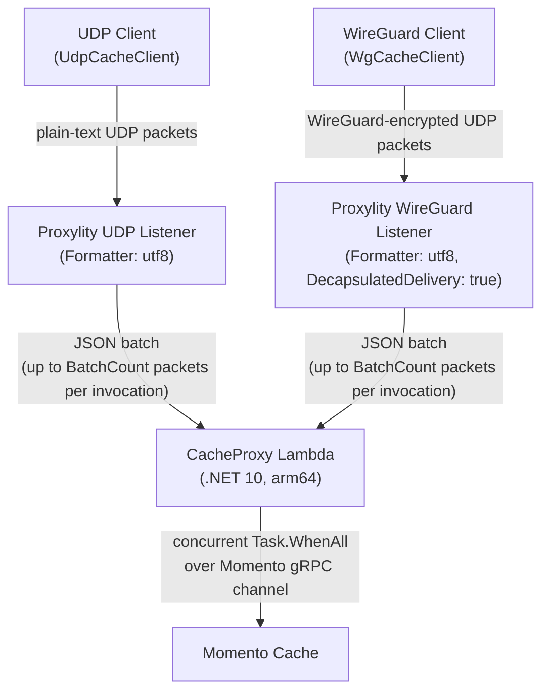

# Momento UDP Cache Proxy

A service that exposes [Momento](https://www.gomomento.com/) cache operations over UDP and/or WireGuard via the [Proxylity](https://proxylity.com/) UDP Gateway. Clients send fire-and-forget GET/SET cache requests; Proxylity batches them into Lambda invocations; the Lambda fans them out as concurrent Momento gRPC calls and replies with the results. The result is equally low latency requests and responses, but with better "goodput" when network conditions degrade and a simpler and more efficient network stack.

To cut to the chase see [Deployment](#deployment), below.

## gRPC as the Starting Point

The Momento SDK and backend expose a gRPC-backed async API, which is a good fit for many applications. It does come with some sharp edges, however, when used on unreliable networks (LTE, WiFi, Industrial, long-haul). 

Using the standard Momento SDK a client call looks like this:

```csharp
// gRPC SDK — caller owns the channel lifecycle
using var client = new CacheClient(
    Configurations.Laptop.Latest(),
    new EnvMomentoV2TokenProvider("MOMENTO_API_KEY"),
    defaultTtl: TimeSpan.FromSeconds(300));

CacheGetResponse response = await client.GetAsync("my-cache", "my-key");
if (response is CacheGetResponse.Hit hit)
    Console.WriteLine(hit.ValueString);
```

The SDK manages the gRPC channel's TCP connection, TLS negotiation, HTTP/2 SETTINGS frame, and keep-alive pings. The application owns the top-level `CacheClient` lifetime (disposing it tears down the connection). Reconnection, backpressure, and request correlation all provided through the HTTP/2 stream layer.

The equivalent using this SDK:

```csharp
// Momento UDP/WireGuard SDK — no connection, no lifetime to manage
        var serverKey = File.ReadAllText(wgServerKeyFile).Trim();
        var privKey   = File.ReadAllText(wgPrivateKeyFile).Trim();
        await using var wgClient = new WgCacheClient(
            new IPEndPoint(Dns.GetHostAddresses(wgHost).First(), wgPort),
            peerPublicKey:  serverKey,
            myPrivateKey:   privKey,
            defaultTtl:     TimeSpan.FromSeconds(300));

CacheGetResponse response = await client.GetAsync("my-key");
if (response is CacheGetResponse.Hit hit)
    Console.WriteLine(hit.ValueString);
```

The client sends a single UDP datagram. There is no connection to establish, no state to maintain, and no session lifetime to manage beyond the socket. The transport is replaced entirely; the `async`/`await` surface is preserved. The complexity that was in the client — channel management, stream multiplexing, reconnection — moves to the Lambda, where it belongs on the server side of the edge.

> **Why is there no `cacheName` parameter?** In the gRPC SDK the cache name is passed on every call, which means a client can target any cache the API key is permitted to reach. The UDP SDK omits it deliberately. The target cache is a __server-side__ policy decision set at deploy time via the `MOMENTO_CACHE_NAME` Lambda environment variable. This prevents a compromised client from directing operations to an unintended cache using the stack's API key. If your use case needs multiple caches, simply deploy one stack per cache. Each will have its own endpoint and its own `MOMENTO_CACHE_NAME` binding.

## Why UDP on the client side?

The problems we're solving are caused when dropped packets flummox the TCP reliability "features", starting with retransmitions. For many cache use cases perfection isn't required and we'd rather treat lost packets as misses quickly than get the right answer slowly. With TCP underlying gRPC we can't really solve that -- hence this UDP based alternative.

Code generally treats cache operations as loss tolerant implicitly -- it's expected that cache items need to be populated, and previously added items may be rotated out based on TTL or other mechanisms. A dropped packet can be seen as a cache miss, which the caller handles by falling back to the authoritative source (i.e. a code path very likely to aready exist). This property makes UDP a good fit and closely aligns the network transport semantics with the application layer.

Beyond loss tolerance, a degraded edge-to-cloud path (Wi-Fi, mobile, public internet) turns TCP's reliability to a liability:

- **Head-of-line blocking.** When TCP loses a packet its retransmission timer stalls *every* request on that connection for as much as a second. Meanwhile, each UDP packet is independent so one drop affects only that single operation and all others proceed without delay. This keeps P99 latency bounded by the application timeout, not the OS retransmission schedule. Because gRPC is uses a single TCP connection it suffers this malady.
- **Connection overhead.** A gRPC client must complete a TCP + TLS handshakes and HTTP/2 configuration before the first cache request can be made. UDP clients fire immediately with no state to establish or maintain. For lightweight devices (IoT) the extended "air time" burns precious power.
- **Connection state to manage.** Reconnection logic, backpressure, encryption state, and keep-alives are the caller's problem with long-lived connections. UDP clients are effectively stateless.

### But there is still gRPC in this backend?

The Lambda in this project communicates with Momento in a server-to-server, in-region, low jitter, and highly reliable envrionment. Under those conditions gRPC's connection overhead amortises well and its congestion control is a virtue. Given that, it's important to note that the `CacheClient` (gRPC connection) survives across warm Lambda invocations so the handshake cost is paid once and reused often.

### The batching layer

UDP Gateway groups up to `BatchCount` UDP datagrams from clients into a single Lambda invocation. The Lambda then sends all of them out over one gRPC channel via `Task.WhenAll` allowing the gRPC SDK to handle responses and complete when they arrive. Clients of UDP SDK therefore benefit from connection multiplexing without needing to know it exists — the complexity lives entirely inside the Lambda.

Tuning the batch size for low latency (smaller batches, down to 1 packet) or low cost (larger batches, fewer lambda calls) is a simple, no-downtime configuration change.

### WireGuard: Modern encryption for UDP

Plain UDP is unprotected and unauthenticated (IP allow lists notwithstanding). A common answer for securing UDP traffic is DTLS, but DTLS inherits much of TLS's handshake overhead and is complex to implement correctly. Another alternative is to run plain UDP inside a WireGuard tunnel.

WireGuard is both a modern encryption transport built on UDP as well as a VPN. The transport provides mutual authentication and encryption with a minimal handshake (one round trip for a fresh session, then stateless from the client's perspective). Importantly, it doesn't involve a TCP or TLS layer (inside or outside). The transport is UDP, and all the latency properties described above are preserved.

`WgCacheClient` is a drop-in replacement for `UdpCacheClient`. Both derive from `CacheClientBase` and share the same wire protocol. The only difference is the transport. On the backend, the Lambda receives identical UTF-8 payloads either way because Proxylity's WireGuard Listener is configured with `DecapsulatedDelivery: true` and strips the WireGuard envelope before invoking the Lambda. This conveniently makes the function code agnostic to the transport choice.

WireGuard vs. plain UDP is a deployment decision controlled by the `ListenerType` stack parameter (also provide the public key of the peer/client in the `WireGuardClientPublicKey` parameter).

 and run the Tester with `--wg-*` flags to benchmark the overhead of encryption on your path. Or, deploy just one or the other as you prefer.

## Architecture



A single Lambda function serves both listeners, each handling all opperations (GET, SET, and DEL). The operation is encoded in the packet payload, so no per-operation functions are needed. The WireGuard listener strips the encapsulation envelope/headers before invoking the Lambda (`DecapsulatedDelivery: true`), so `Function.cs` is identical for both transports.


## Repository Structure

```
template.yaml          SAM template — Lambda, IAM role, Proxylity listeners (UDP + WireGuard), CloudWatch dashboard
src/
  CacheProxy/          AWS Lambda function (.NET 10)
    Function.cs        Handler, Momento dispatch, Proxylity wire types — shared by both listeners
    CacheProxy.csproj
  SDK/                 UDP client library (.NET 10)
    CacheClientBase.cs Abstract base: reqId correlation, receive loop, GET/SET/DEL API
    UdpCacheClient.cs  Plain UDP transport
    WgCacheClient.cs   WireGuard transport (drop-in replacement for UdpCacheClient)
    SDK.csproj
  Tester/              Console test harness (.NET 10)
    Program.cs         Benchmarks both transports back-to-back when --wg-* flags are supplied
    Tester.csproj
```


## Wire Protocol

All packets are plain UTF-8, newline-delimited. `reqId` is always the first field so clients can match responses to requests on a shared socket.

### Requests (client → Proxylity → Lambda)

| Operation | Format |
|-----------|--------|
| GET | `{reqId}\nGET\n{key}` |
| SET | `{reqId}\nSET\n{key}\n{ttlSeconds}\n{base64value}` |
| DEL | `{reqId}\nDEL\n{key}` |

### Responses (Lambda → Proxylity → client)

| Status | Format | Meaning |
|--------|--------|---------|
| HIT | `{reqId}\nHIT\n{base64value}` | Cache hit; value returned as Base64 |
| MISS | `{reqId}\nMISS` | Key not found |
| OK | `{reqId}\nOK` | SET or DEL succeeded |
| ERR | `{reqId}\nERR\n{message}` | Operation failed |

### Formatter: utf8

The Proxylity Destination is configured with `Formatter: utf8`. This means:
- `RequestPacket.Data` arrives in the Lambda as a plain UTF-8 string (no base64 envelope).
- `ResponsePacket.Data` must be returned as a plain UTF-8 string.
`{base64value}` is the Base64 encoding of the raw cache value bytes, which incurs some overhead when decoded to send via gRPC.

## Components

### CacheProxy — Shared AWS Lambda Destination for UDP Gateway Listeners

- **Runtime**: `dotnet10`, architecture `arm64`
- **Handler**: `bootstrap` (executable assembly, top-level statements)
- Holds a persistent `CacheClient` gRPC channel across warm invocations.
- Uses `Task.WhenAll` to fan out all packets in a batch as concurrent Momento SDK calls.
- Reads `MOMENTO_API_KEY` and `MOMENTO_CACHE_NAME` from environment variables (injected by SAM from SSM Parameter Store and the `MomentoCacheName` parameter).

> **Note:** This Lambda would be compiled with NativeAOT and deployed to the `provided.al2023` runtime to minimise cold-start latency. Unfortunately, that isn't currently possible. The `Momento.Sdk` library's `Momento.Protos` dependency pulls in `Grpc` , which wraps a native C shared library via P/Invoke (fundamentally incompatible with NativeAOT). Additionally, `Google.Protobuf` and `JWT`  both use reflection-based serialisation without AOT source generator support. If Momento publishes an AOT-compatible SDK in future, switching to `provided.al2023` and adding `<PublishAot>true</PublishAot>` to the project would be the path to faster cold starts (down to ~100ms).  Another alternative would be to use the Momento HTTP API, but that brings other issues to bear.

### SDK — WireGuard and UDP Client Library

The `WgCacheClient` and `UdpCacheClient` provide a simple, `async` API and are compatible with AoT (Ahead of Time compilation):

```csharp
await using var client = new UdpCacheClient("your-proxylity-host", port,
    defaultTtl: TimeSpan.FromSeconds(300));

CacheSetResponse    set = await client.SetAsync("my-key", "hello");
CacheGetResponse    get = await client.GetAsync("my-key");
CacheDeleteResponse del = await client.DeleteAsync("my-key");
```

In each client a single UDP socket handles all concurrent operations (making requests, handling responses). This requires solving the same request/response correlation problem that gRPC handles transparently via HTTP/2 stream IDs: Responses can arrive in any order over a shared socket and must be routed back to the correct caller.

The solution is the `reqId` field. Each request gets a unique ID from `Interlocked.Increment`, embedded as the first newline-delimited field. The receive loop parses the leading `reqId` of every incoming datagram and routes it to the correct `TaskCompletionSource` via `ConcurrentDictionary` lookup. The result is the same async/await surface as the gRPC SDK, implemented in ~20 lines rather than an HTTP/2 stack. No semaphore or socket pool is required.

### Tester Console App

Benchmark and test harness that exercises the SDK against a deployed stack. References the SDK project directly. Runs a warm-up seed phase, a timed throughput run with configurable concurrency, and a correctness spot-check (SET → GET → DEL → GET).


## Design Constraints and Trade-offs

### Packet size

Each cache operation must fit in a single UDP datagram. In practice the effective payload is limited to roughly 1,200–1,400 bytes before IP fragmentation occurs (a limit that does not exist for gRPC). This makes the UDP design appropriate for small cache values (tokens, feature flags, compact JSON) but unsuitable for arbitrary blobs. A more sophisticated protocol would be neccessary for larger values, but the gRPC SDK makes the most sense for those cases.

> **Note:** The Base64 encoding of the value in SET and HIT packets adds ~33% size overhead. Making the actual maximum raw binary value about 900 bytes (~1,200 bytes on the wire, which is near the safe limit). This is easy to improve using a binary encoding, but the MTU limit remains.

### Timeout is a miss

`CacheClientBase` imposes a 1-second timeout on every pending request. The correct interpretation of each result type is:

| Result | Meaning | Correct caller action |
|--------|---------|----------------------|
| `CacheGetResponse.Hit` | Cache hit | Use the value |
| `CacheGetResponse.Miss` | Genuine miss | Fall back to authoritative source |
| `TimeoutException` or `CacheGetResponse.Error` | Packet lost or operation failed | Treat as miss; fall back to authoritative source |

The logic behind "cache operations are loss-tolerant" is that the failure mode is handled at the application level, rather than by retransmission (quick is better than correct). The caller's fallback path is likely already required for genuine misses and can absorbs dropped packets with no additional complexity.

In keeping with .Net conventions a timeout generates an exception which must be handled approapriately by the application. 

## Deployment

### Prerequisites

- [AWS SAM CLI](https://docs.aws.amazon.com/serverless-application-model/latest/developerguide/install-sam-cli.html)
- .NET 10 SDK
- A Momento account with an API key stored in SSM Parameter Store at `/momento-udp-cache/api-key`
- A Proxylity account (the SAM template pulls your Proxylity config from an S3 include)
- A WireGuard client key pair (required before deploying, because the default `ListenerType=both` creates a WireGuard listener that must be seeded with your public key):

  ```bash
  wg genkey | tee client_private.key | wg pubkey > client_public.key
  ```

  Store `client_private.key` securely and do not commit it to source control.

### Deploy

```bash
sam build
sam deploy --guided --parameter-overrides WireGuardClientPublicKey=$(cat client_public.key)
```

Key SAM parameters:

| Parameter | Default | Description |
|-----------|---------|-------------|
| `MomentoCacheName` | `udp-demo` | Momento cache to use |
| `MomentoApiKeyParam` | `/momento-udp-cache/api-key` | SSM path to the Momento API key |
| `BatchCount` | `25` | UDP packets per Lambda invocation (= Task.WhenAll width) |
| `BatchTimeoutSeconds` | `0.05` | Max seconds to wait for a full batch before firing |
| `ClientCidrToAllow` | `0.0.0.0/0` | CIDR restriction on the Proxylity listener |
| `ListenerType` | `both` | Which listeners to create: `udp`, `wireguard`, or `both` |
| `WireGuardClientPublicKey` | *(empty)* | Client WireGuard public key (required when `ListenerType` is `wireguard` or `both`) |

The stack outputs `CacheEndpoint` (plain UDP), `CacheEndpointWg` (WireGuard), and `WireGuardPublicKey` (base64 server key). Save all outputs to a file and extract the values with `jq`:

```bash
aws cloudformation describe-stacks --stack-name <stack> \
  --query "Stacks[0].Outputs" --output json > stack-outputs.json

udp_endpoint=$(jq -r '.[] | select(.OutputKey=="CacheEndpoint")   | .OutputValue' stack-outputs.json)
wg_endpoint=$(jq  -r '.[] | select(.OutputKey=="CacheEndpointWg") | .OutputValue' stack-outputs.json)
jq -r '.[] | select(.OutputKey=="WireGuardPublicKey") | .OutputValue' stack-outputs.json > server_public.key
```

### Build & Run Tester

Split each `host:port` endpoint into separate variables, then run the tester. The default `ListenerType=both` benchmarks both transports back-to-back for easy comparison:

```bash
udp_host=${udp_endpoint%:*}; udp_port=${udp_endpoint##*:}
wg_host=${wg_endpoint%:*};   wg_port=${wg_endpoint##*:}

cd src/Tester
# Run default benchmark
dotnet run -- \
  --udp-host $udp_host --udp-port $udp_port \
  --wg-host  $wg_host  --wg-port  $wg_port  \
  --wg-server-key-file  server_public.key \
  --wg-private-key-file client_private.key

# Run modified benchmark
dotnet run -- \
  --udp-host $udp_host --udp-port $udp_port \
  --wg-host  $wg_host  --wg-port  $wg_port  \
  --wg-server-key-file  server_public.key \
  --wg-private-key-file client_private.key \
  # Tune concurrency, duration, TTL, and key-space size
  --concurrency 50 --duration 30 --ttl 60 --key-count 5000

dotnet run -- --help
```

## Observability

A CloudWatch Dashboard (`{StackName}-performance`) is deployed automatically with widgets for:
- Lambda Duration (p50 / p95 / p99)
- Invocations, Errors, and Concurrent Executions
- Cold-start Init Duration
