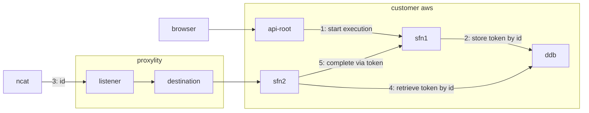

# Multi-Modal HTTP and UDP Workflow

This example demonstrates a workflow in which a browser (HTTP) request must match a correlated UDP event to complete a high-level task. The example uses UDP Gateway alongside AWS API Gateway with shared state in DynamoDB and StepFunctions providing the logic.

1. A visitor to the API root resource causes an execution of the `RootStateMachine` state machine, and the resulting execution ID is returned to the user (trivially rendering to HTML). 
2. The state machine runs asynchronously (note it is of the STANDARD type to make this "idle" time cost effective) to save the execution ID and task token to DynamoDB, then pauses execution (using the `.waitForTaskToken` task ARN suffix) waiting for the UDP message to complete the task.  
3. Next, using `ncat` or similar, the execution ID returned from the HTTP request is sent via UDP to the Listener and delivered to the `UdpStateMachine`.
4. The `UdpStateMachine` state machine retrieves the `TaskToken` from DynamoDB by querying with the execution ID as the PK.
5. The `UdpStateMachine` "completes" the task token to trigger the continuation of the `RootStateMachine` from the Wait task, completing its execution.  

This type of advanced multi-modal flow can be found in matchmaking for multi-player games, Wi-Fi portal authentication, IoT device onboarding and other use cases. Using UDP Gateway allows using serverless architectures from end-to-end, which simplifies development and lowers operational complexity and cost.

## System Diagram



## Deploying

> **NOTE**: The instructions below assume the `aws` CLI, `jq` and `ncat` are available on your Linux system. 

This template protects the API with a 20-31 character API key so random visitors can't trigger it, and there are rate limits applied, too.  None of this is really necessary, but are good practices when making APIs available in public. You'll see the API key being added to the `curl` commands that follow.

```bash
export API_KEY=$(tr -dc A-Za-z0-9_+.~ </dev/urandom | head -c $[20 + $RANDOM % 12])
```

Next we deploy the template, providing the API key as a parameter:

```bash
aws cloudformation deploy \
  --template-file multi-modal.template.json \
  --stack-name multimodal-example \
  --capabilities CAPABILITY_IAM \
  --parameter-overrides \
    ApiKeyValue=${API_KEY} \
  --region us-west-2
```

The template creates a few resources, including the API Gateway and UDP Gateway Listener endpoints. To exercise them we need the endpoint information from the stack output, which we'll put in environment variables for easy use.  First we'll describe the stack and write the response to a JSON file, then use `jq` to extract the values:

```bash
aws cloudformation describe-stacks \
  --stack-name multimodal-example \
  --query "Stacks[0].Outputs" \
  --region us-west-2 \
  > outputs.json

export API_ENDPOINT=$(jq -r ".[]|select(.OutputKey==\"ApiEndpoint\")|.OutputValue" outputs.json)
export UDP_DOMAIN=$(jq -r ".[]|select(.OutputKey==\"Domain\")|.OutputValue" outputs.json)
export UDP_PORT=$(jq -r ".[]|select(.OutputKey==\"Port\")|.OutputValue" outputs.json)
```

To start the workflow we'll perform a GET on the root resource of the API Gateway.  This causes the API to start (execute) the state machine and return the ID: 

```bash
curl ${API_ENDPOINT} -H "x-api-key: ${API_KEY}" > response.html
more response.html
```

That should return HTML content showing a bash command (including your request-specific execution ID) and the UDP endpoint to "complete" the process:
                                                                                                                                                                                                                      
```html
<html><body>
<h2>Command to set envar:</h2>
<pre>export EXECUTION_ID="eb0a7644-b8d2-41c2-9db3-15734e6229f7"</pre>
<h2>Your UDP endpoint is: </h2>
<pre>ingress-1.proxylity.com:2062</pre>
</body></html>
```

Let's copy/paste that `export` command to set the `EXECUTION_ID` environment variable since we'll be using it a few times below:

```bash
export EXECUTION_ID="{your execution ID here}"
```

We can verify the state machine execution is there and waiting to be resumed by making a GET request to the `poll` endpoint (make sure you have copy and pasted your execution ID into an environment variable, per above):

```bash
curl "${API_ENDPOINT}/poll?executionId=${EXECUTION_ID}" -H "x-api-key: ${API_KEY}"
```

That should show that the status is "RUNNING":

```json
{
  "status": "RUNNING"
}
```

Now we can send the execution ID to the UDP Gateway Listener, which will execute the `UdpStateMachine` resource and respond with a success or failure message:

```bash
(printf "${EXECUTION_ID}" && sleep 2) | ncat -u $UDP_DOMAIN $UDP_PORT -w 2
```

A "SUCCESS" outcome indicates the `RootStateMachine` was resumed, at which point it runs to completion, which we can verify by polling again:

```bash
curl "${API_ENDPOINT}/poll?executionId=${EXECUTION_ID}" -H "x-api-key: ${API_KEY}"
```

This time the status should come back as completed:

```json
{
  "status": "SUCCEEDED"
}
```

And, to verify that the execution ID presented by the initial visit to the API root can only be used once, we can try to send a second UDP message containing the same execution ID:

```bash
(printf "${EXECUTION_ID}" && sleep 2) | ncat -u $UDP_DOMAIN $UDP_PORT -w 2
```

This time it responds with a "FAILED" message, because the execution has completed and cannot be resumed.  This kind of multi-modal, interlocked flow is common in hardware integrations and with UDP Gateway can be implemented in a very modern, AWS native way.

To remove all the resources created by the example stack:

```bash
aws cloudformation delete-stack --stack-name multimodal-example --region us-west-2
```

## Implementation Notes

### State Machine Integration with Task Tokens

The solution uses Step Functions' task tokens to coordinate between HTTP and UDP workflows. The root state machine stores its task token in DynamoDB using a composite key:
- Partition Key (PK): The execution ID (extracted from the full ARN)
- Sort Key (SK): The task token itself

This allows the UDP workflow to efficiently look up the task token using just the execution ID received via UDP.

### API Gateway Configuration

The API Gateway uses native integration with Step Functions APIs:
- `StartExecution` for the root endpoint
- `DescribeExecution` for the poll endpoint

Both endpoints require API keys and have rate limiting applied via a usage plan (1 request/second with burst of 2).

### UDP Processing

The UDP state machine uses an EXPRESS workflow type for fast processing and includes:
- Base64 decoding of the received UDP packet to extract the execution ID
- DynamoDB query to retrieve the stored task token
- Error handling with explicit success/failure responses
- Detailed logging and X-Ray tracing enabled

This design pattern could be extended to support more complex flows involving multiple UDP messages or bi-directional communication.

