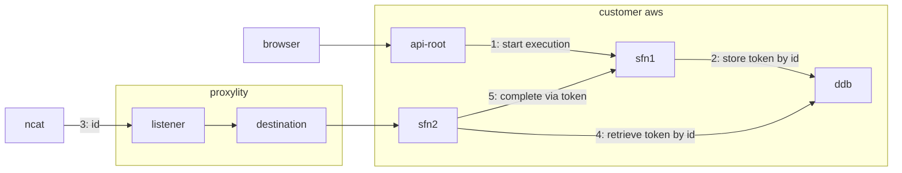

# Multi-Modal HTTP and UDP Workflow

This example demonstrates a workflow in which a browser request coordinates with UDP events using UDP Gateway along with AWS API Gateway, DynamoDB and StepFunctions.  

1. A visitor to the API root resource is causes an execution of the `RootStateMachine` resource, with the resulting execution ID being displayed to the user (trivial rendering to HTML). 
2. The statemachine runs asyncrounously (note the STANDRD type) and saves the execution ID and task token to DynamoDB, then pauses execution due to the `.waitForTaskToken` suffix on the Task `Resource`.  
3. Next, using `ncat` or similar, the ID can be sent via UDP to the Listener and delivered to the `UdpStateMachine` by the Destination.
4. The state machine which retrieves the `TaskToken` from DynamoDB.
5. Then it uses the task token to trigger the completion of the wait task and allowing the first `RootStateMachine` execution to continue.  

This type of flow can be found in Wi-Fi portal authentication, IoT device onboarding and other use cases. The basic construction here can be built on for more complex interactions and business logic.

## System Diagram



## Deploying

> **NOTE**: The instructions below assume the `aws` CLI, `jq` and `ncat` are available on your Linux system. 

To deploy the template:

```bash
aws cloudformation deploy \
  --template-file multi-modal.template.json \
  --stack-name multimodal-example \
  --capabilities CAPABILITY_IAM \
  --region us-west-2
```

The template will create a few resources, including an API Gateway and a UDP Gateway Listener.  To exercise them we need to grab the connection information for each from the stack outputs, and pit them in environment variables for easy use:

```bash
aws cloudformation describe-stacks \
  --stack-name multimodal-example \
  --query "Stacks[0].Outputs" \
  --region us-west-2 \
  > outputs.json

export API_ENDPOINT=$(jq -r ".[]|select(.OutputKey==\"ApiEndpoint\")|.OutputValue" outputs.json)
export API_KEY=$(jq -r ".[]|select(.OutputKey==\"ApiKey\")|.OutputValue" outputs.json)

export UDP_DOMAIN=$(jq -r ".[]|select(.OutputKey==\"Domain\")|.OutputValue" outputs.json)
export UDP_PORT=$(jq -r ".[]|select(.OutputKey==\"Port\")|.OutputValue" outputs.json)
```

To start the workflow we'll perform a GET on the root resource of the API Gateway, just as visiting with a browser would do. 

> **Note:** This template protects the API with an API key so random visitors can't trigger it, and there are rate limits applied, too.  None of this is really necessary, but are good practices when making APIs available in public. You'll see the API key being added to the `curl` commands that follow.

```bash
curl ${API_ENDPOINT} -H "x-api-key: ${API_KEY}"
```

That should return a result that looks something like this, but with an actual execution ID:

```html
<html><body>Execution ID: {your execution ID here}</body></html>
```

Let's capture that execution ID in a veriable since we'll be using it a few times:

```bash
export EXECUTION_ID="{paste your execution ID here}"
```

To verify the state machine execution is there, and waiting to be resumes we can make a GET request to the `poll` endpoint (make sure you copy and paste your execution ID into an envar, per above):

```bash
curl "${API_ENDPOINT}/poll?executionId=${EXECUTION_ID}" -H "x-api-key: ${API_KEY}"
```

That should show that the status is "RUNNING":

```json
{
  "status": "RUNNING"
}
```

Now we can send the execution ID to the UDP Gateway Listener, which will execute the `UdpStateMachine` resource and respond with a success or failure message:

```bash
(printf "${EXECUTION_ID}" && sleep 2) | ncat -u $UDP_DOMAIN $UDP_PORT -w 2
```

A "SUCCESS" outcome indicates the `RootStateMachine` was resumed, at which point it runs to completion, which we can verify by polling again:

```bash
curl "${API_ENDPOINT}/poll?executionId=${EXECUTION_ID}" -H "x-api-key: ${API_KEY}"
```

This time the status should come back as compeleted:

```json
{
  "status": "COMPLETED"
}
```

And, to verify that the execution ID presented by the initial visit to the API root can only be used once, we can try to send a second UDP message containing the same execution ID:

```bash
(printf "${EXECUTION_ID}" && sleep 2) | ncat -u $UDP_DOMAIN $UDP_PORT -w 2
```

This time it responds with a "FAILED" message, because the execution has completed and cannot be resumed.  This kind of multi-model, interlocked flow is common in hardware integrations and with UDP Gateway can be implenented in a very modern, AWS native way.

To remove all the resources created by the example stack:

```bash
aws cloudformation delete-stack --stack-name packet-counter-example --region us-west-2
```

## Implementation Notes

### State Machine Integration with Task Tokens

The solution uses Step Functions' task tokens to coordinate between HTTP and UDP workflows. The root state machine stores its task token in DynamoDB using a composite key:
- Partition Key (PK): The execution ID (extracted from the full ARN)
- Sort Key (SK): The task token itself

This allows the UDP workflow to efficiently look up the task token using just the execution ID received via UDP.

### API Gateway Configuration

The API Gateway uses native integration with Step Functions APIs:
- `StartExecution` for the root endpoint
- `DescribeExecution` for the poll endpoint

Both endpoints require API keys and have rate limiting applied via a usage plan (1 request/second with burst of 2).

### UDP Processing

The UDP state machine uses an EXPRESS workflow type for fast processing and includes:
- Base64 decoding of the received UDP packet to extract the execution ID
- DynamoDB query to retrieve the stored task token
- Error handling with explicit success/failure responses
- Detailed logging and X-Ray tracing enabled

This design pattern could be extended to support more complex flows involving multiple UDP messages or bi-directional communication.

