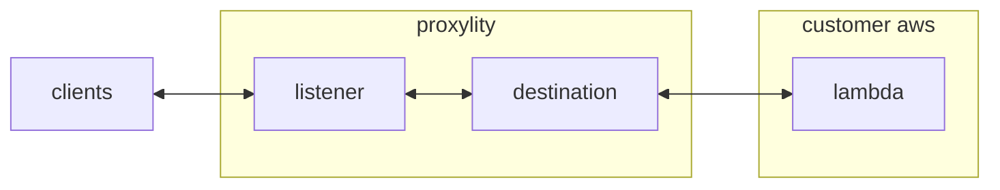

## Packet Counter

This example demonstrates a packet counting UDP endpoint implemented with Proxylity UDP Gateway and AWS Lambda.  Clients sending packets to the endpoint will receive responses containing the quantity of packets received per batch. If a single packet is sent to the endpoint, a single response will be returned with string value `1` as the content.  At higher rates the number in the return packet will increase and it is likely that more than one response will be received due to the multi-region/multi-AZ infrastructure employed by UDP Gateway.

This example demonstrates:

* Using the Proxylity listener custom resource type for CloudFormation.
* Handling batches of UDP packet in AWS Lambda.
* Selectively/conditionally generating responses to packets.

## System Diagram



## Deploying

> **NOTE**: The instructions below assume the `aws` CLI, `jq`, `docker`, `sam` and `ncat` are available on your Linux system.\
> Also, it is assumed you have an S3 Bucket on AWS for `sam` to work with.\
> **C++** Version Requirement for this example is `17`.

To compile binary and setup artifact for deployment:

```bash
sam build --template-file ./packet-counter.template.json
```

To deploy the template:

```bash
sam deploy \
    --stack-name packet-counter-example \
    --capabilities CAPABILITY_IAM \
    --region us-west-2 \
    --s3-bucket <bucket-name>
```

Once deployed, the endpoint can be tested with `ncat` and the endpoint information provided in the outputs of the stack. To get the ouputs from the stack and store the salient values in environment variables:

```bash
aws cloudformation describe-stacks \
  --stack-name packet-counter-example \
  --query "Stacks[0].Outputs" \
  --region us-west-2 \
  > outputs.json 

export PACKET_COUNTER_DOMAIN=$(jq -r ".[]|select(.OutputKey==\"Domain\")|.OutputValue" outputs.json)
export PACKET_COUNTER_PORT=$(jq -r ".[]|select(.OutputKey==\"Port\")|.OutputValue" outputs.json)
```

Then to send a single test packet and output the response:

```bash
echo -e Response: $((echo "test" && sleep 2) | ncat -u ${PACKET_COUNTER_DOMAIN} ${PACKET_COUNTER_PORT} -w2)
```

That should elicite output of "Response: 1".

To remove the example stack:
```bash
aws cloudformation delete-stack --stack-name packet-counter-example --region us-west-2
```

## Lambda Implementation

Proxylity forwards packet data to Lambda in JSON format, per the documented [JSON Schema](https://www.proxylity.com/docs/destinations/json-packet-format.html). In this lambda we're interested in a subset of the properties:

```jsonc
{
  "Messages": [
    { 
      "Tag": "",
      "Remote": {
        "IpAddress": "",
        "Port": 0
      },
      // ...
      "Data": "<Base64>"
    },
    // ...
  ]
}
```

The output of the Lambda instructs Proxylity what responses, if any, to send in for each input packet. It's okay to not include all `Tag` values in the output and produce few response, or even none:

```jsonc
{
  "Replies": [
    { 
      "Tag": "",
      // ...
      "Data": "<Base64>"
    },
    // ...
  ]
}
```

The first step in the code is to count the number of packets in the batch that come from the same IP:

```cpp
// Count packets per source IP
std::unordered_map<std::string, int> counts;
for (auto& msg : inbound.Messages) {
    counts[msg.remote.IpAddress]++;
}
```

The second step is to generate the replies (outbound/response packets), but only send one response per IP.  The code uses a helper function that keeps track of which IPs already have a response by clearing the entry in the map of counts and base64 encoding the response data:

```cpp
// Helper to get & clear count and encode
auto get_and_clear = [&](std::unordered_map<std::string,int>& m, const std::string& key) -> std::optional<std::string> {
    auto it = m.find(key);
    if (it == m.end() || it->second == 0) return std::nullopt;
    int value = it->second;
    it->second = 0;
    return base64_rfc4648::encode(std::to_string(value) + "\n");
};
```

The list of response packets is then generated via a looping function:

```cpp
// Build replies
Response resp;
for (auto& msg : inbound.Messages) {
    std::cout << msg.Tag << std::endl;
    auto data = get_and_clear(counts, msg.remote.IpAddress);
    if (!data.has_value()) continue;
    
    resp.Replies.push_back({
        current_utc_iso(),
        msg.Tag,
        data.value()
    });
}
```

And finally, wrapped in the expected `Replies` property to return to Proxylity:

```cpp
json out_json;
for (auto& r : resp.Replies) {
    out_json["Replies"].push_back({
        {"GeneratedAt", r.GeneratedAt},
        {"Tag", r.Tag},
        {"Data", r.Data}
    });
}

return invocation_response::success(out_json.dump(), "application/json");
```
