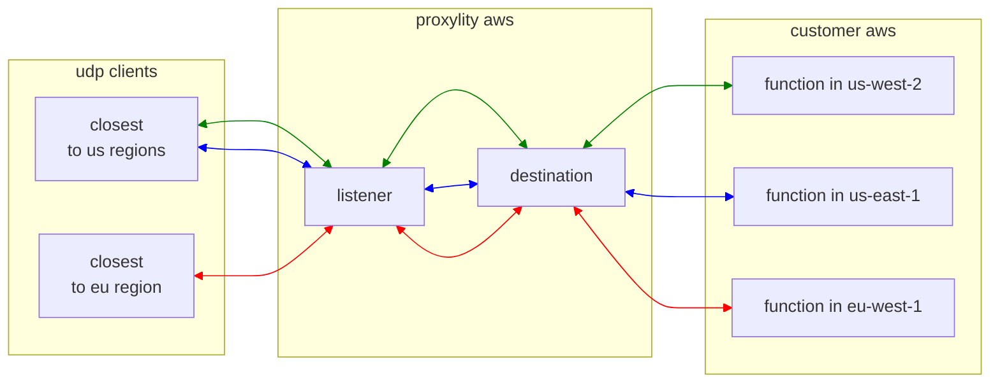

## Packet Counter

This example takes the [packet-counter](../packet-counter/) example and gives it global (multi-region) super powers. It deploys the Lambda function to three AWS regions and supplies the ARNs the Proxylity Destination, the result being that Proxylity chooses the Lambda function instance that's closest (by latency) to the region where the UDP traffic arrives.

This example demonstrates:

* Using the Proxylity listener custom resource type for CloudFormation.
* Configuring a Destination with region-specific ARNs so Proxylity can use the same-region Lambda function when delivering packets.
* Configuring an IAM role for proxylity that allows calling the regional Lambda functions.

## System Diagram



## Deploying

> **NOTE**: The instructions below assume the `aws` CLI, `jq` and `ncat` are available on your Linux system. 

The first step is to setup the regional resources (just the Lambda), so we'll loop through the regions creating a stack from the regional template in each:

```bash
for region in us-west-2 us-east-1 eu-west-1; do aws cloudformation deploy \
  --template-file packet-counter-region.template.json \
  --stack-name packet-counter-region \
  --capabilities CAPABILITY_IAM \
  --region $region \
; done
```

Next we create the "global" resources, which are created only once (unlike the Lambda function above). These resources include the Proxylity Listener and Destination, as well as the IAM role that will be used by Proxylity to access the Lambdas:

```bash
aws cloudformation deploy \
  --template-file packet-counter-global.template.json \
  --stack-name packet-counter-global \
  --capabilities CAPABILITY_IAM \
  --region us-west-2
```

Once all the stacks are created the Listener can be tested with `ncat` and the endpoint information provided in the output of the `packet-counter-global` stack. To get the ouputs from the stack and store the values in environment variables:

```bash
aws cloudformation describe-stacks \
  --stack-name packet-counter-global \
  --query "Stacks[0].Outputs" \
  --region us-west-2 \
  > outputs.json 

PACKET_COUNTER_DOMAIN=$(jq -r ".[]|select(.OutputKey==\"Domain\")|.OutputValue" outputs.json)
PACKET_COUNTER_PORT=$(jq -r ".[]|select(.OutputKey==\"Port\")|.OutputValue" outputs.json)
```

Then to send a single test packet and output the response:

```bash
echo -e Response: $((echo "test" && sleep 2) | ncat -u ${PACKET_COUNTER_DOMAIN} ${PACKET_COUNTER_PORT} -w2)
```

That should elicite output of "Response: 1".

To remove the example stack:
```bash
for region in us-west-2 us-east-1 eu-west-1; do aws cloudformation delete-stack \
  --stack-name packet-counter-region \
  --region $region; done
aws cloudformation delete-stack --stack-name packet-counter-example --region us-west-2
```

## About this Example

When a Destination is created with a single ARN, Proxylity will use that specific resource even when it means making cross-region calls when a client is closest to a different AWS region via Proxylity's anycast IP addresses. A good practice with AWS is to avoid such cross-region dependencies, and that's where having region-specific destination ARNs comes in handy.

When a global client base and/or deployment is expected, we recommend using region-specific destination ARNs as demonstrated in this example. Creating packet counter Lambda function instances in two US and one EU region means that traffic from clients in the UK and EU are likely to have traffic routed to the EU region where a Lambda instance is resident, hence avoiding the latency and coupling of a cross-region call. Traffic arriving at any region other than these three will automatically be directed to the Lambda function instance in the region that is "closest" by latency (according to [cloudping.co](https://cloudping.co)). 

In addition to latency benefits, multi-region destinations provide additional reliability and insulate your backend against the possibility of a regional AWS outage.

> **Note:** The three regions in this example are those that were supported by Proxylity at the time of writing. It's likely that new regions will be added, so be sure to check [the docs](https://www.proxylity.com/docs/index.html) for the currently supported regions.

