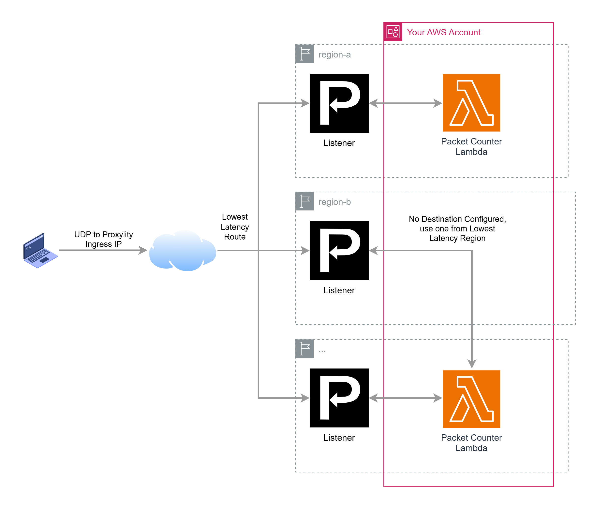

## Packet Counter - Multi-Region

This example takes the [packet-counter](../packet-counter/) example and gives it global (multi-region) super powers. It deploys the Lambda function to three AWS regions and supplies the ARNs the Proxylity Destination, the result being that Proxylity chooses the Lambda function instance that's closest (by latency) to the region where the UDP traffic arrives.

This example demonstrates:

* Using the Proxylity listener custom resource type for CloudFormation.
* Configuring a Destination with region-specific destination ARNs for performance an resilience.
* Configuring an IAM role for proxylity that allows calling the regional Lambda functions.

## System Diagram

Going from single-region solutions to resilient, globally deployed solutions is incredibly easy with UDP Gateway. By following the global/regional template pattern, region-specific destination ARNs allow UDP Gateway to use same-region resources (a Lambda function in this example) when available, and fall-back to resources in a "nearby" AWS region when they aren't.

In the diagram below the laptop is sending packets to the ingress endpoint IP and port associated with the UDP Gateway Listener.  Based on the geographic location of the sender, packets will be routed to one of the ingress regions supported by UDP Gateway. When the packets arrive at the Listener the configuration is checked to see if there is a resource in the same region. If so, packets are delivered to that resource.  If not, the next closest resource (by inter-region ping) is selected and packets delivered to it.



In addition to the performance benefits of multi-region deployments, resilience is also substantially improved. If a region is in partial or complete failure, traffic is automatically directed to one where a healthy listener can be found. 

From a developer perspective, this architecture consists of a single Listener deployment, and a set of Destination ARN deployments. Regions can be added and removed at any time without service interruption.

## Deploying

> **NOTE**: The instructions below assume the `aws` CLI, `jq` and `ncat` are available on your Linux system. 

First we create the "global" Listener resource, which is deployed only once. The template includes the Proxylity Listener and Destination (no ARNs assigned), as well as the shaped IAM Role that will be used by Proxylity to access the Lambdas we'll created below:

```bash
aws cloudformation deploy \
  --template-file packet-counter-global.template.json \
  --stack-name packet-counter-global \
  --capabilities CAPABILITY_IAM \
  --region us-west-2
```

We'll need the the information in the output of the stack, so next we'll grab them and store the values we need in environment variables:

```bash
aws cloudformation describe-stacks \
  --stack-name packet-counter-global \
  --query "Stacks[0].Outputs" \
  --region us-west-2 \
  > outputs.json 

export PACKET_COUNTER_DOMAIN=$(jq -r ".[]|select(.OutputKey==\"Domain\")|.OutputValue" outputs.json)
export PACKET_COUNTER_PORT=$(jq -r ".[]|select(.OutputKey==\"Port\")|.OutputValue" outputs.json)
export PACKET_COUNTER_DESTINATION_ID=$(jq -r ".[]|select(.OutputKey==\"DestinationId\")|.OutputValue" outputs.json)
```

The next step is to deploy the regional resources (the Lambda and DestinationArn to connect it to the Listener). We'll loop through the list of regions we'll support, deploying a stack from the regional template in each one:

```bash
for region in us-west-2 us-east-1 eu-west-1; do aws cloudformation deploy \
  --template-file packet-counter-region.template.json \
  --stack-name packet-counter-region \
  --capabilities CAPABILITY_IAM \
  --parameter-overrides DestinationId=$PACKET_COUNTER_DESTINATION_ID \
  --region $region \
; done
```

Once all (or even one) the stacks are created the solution can be tested using `ncat` to send a single test packet and then output the response:

```bash
echo -e Response: $((echo "test" && sleep 2) | ncat -u ${PACKET_COUNTER_DOMAIN} ${PACKET_COUNTER_PORT} -w2)
```

That should elicite output similar to "Response: 1 us-west-2" if everything is working correctly. The repo also include a more robust testing tool `packet_counter_test.py` which sends batches of 100 packets, counts the responsed by region and measures latency:

```bash
chmod +x packet_counter_test.py
./packet_counter_test.py $PACKET_COUNTER_DOMAIN $PACKET_COUNTER_PORT
```

That should generate output something like:

```
Sending 100 packets to ingress-1.proxylity.com:nnnn (76.223.93.174)...
Successfully sent 100/100 packets to send buffer.
Waiting for responses (timeout: 5.0s)...

============================================================
RESULTS
============================================================

Packets attempted: 100
Packets successfully queued for send: 100
Packets received (total from responses): 100
Packets lost in transit: 0

------------------------------------------------------------
LATENCY BY AWS REGION
------------------------------------------------------------

Region: us-west-2
  Responses: 100
  Min latency: 145.32 ms
  Max latency: 1187.92 ms
  Avg latency: 283.31 ms

============================================================
```

It's very likely all of your responses will be from the same region, you might try deleting that region's stack. You should find that responses then come from the next closest region.

You might also find it interesting to adjust the batching parameters (count and time) on the destination in the global template. Adjusting the count higher will result in fewer responses, while reducing the batch time will result in lower latency but a higher number of responses.

To remove all the regional stacks and the global stack:
```bash
for region in us-west-2 us-east-1 eu-west-1; do aws cloudformation delete-stack \
  --stack-name packet-counter-region \
  --region $region; done
```
Once the regional stacks are deleted, we can also remove the global stack:
```bash
aws cloudformation delete-stack --stack-name packet-counter-example --region us-west-2
```

## About this Example

When a Destination is created with a single ARN, Proxylity will use that specific resource even when it means making cross-region calls. A good practice with AWS is to avoid such cross-region dependencies, and that's where having region-specific destination ARNs comes in handy.

If you support a global client base and/or a global deployment is expected, we recommend using region-specific destination ARNs as demonstrated in this example. Creating packet counter Lambda function instances in two US and one EU region means that traffic from clients in the UK and EU are likely to have traffic routed to the EU region where a Lambda instance is resident, hence avoiding the latency and coupling of a cross-region call. Traffic arriving at any region other than these three will automatically be directed to the Lambda function instance in the region that is "closest" by latency (according to [cloudping.co](https://cloudping.co)). 

In addition to latency benefits, multi-region destinations provide additional reliability and insulate your backend against the possibility of a regional AWS outage.

> **Note:** The regions in this example are/were supported by Proxylity at the time of writing. It's likely that new regions will be added, so be sure to check [the docs](https://www.proxylity.com/docs/index.html) for the currently supported regions.

