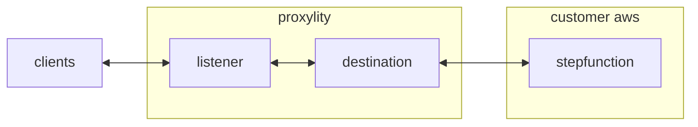

## Packet Counter

This example demonstrates a packet counting UDP endpoint implemented with Proxylity UDP Gateway and AWS Step Functions.  Clients sending packets to the endpoint will receive responses containing the quantity of packets received per batch. If a single packet is sent to the endpoint, a single response will be returned with string value `1` as the content.  At higher rates the number in the return packet will increase and it is likely that more than one response will be received due to the multi-region/multi-AZ infrastructure employed by UDP Gateway.

This example demonstrates:

* Using the Proxylity listener custom resource type for CloudFormation.
* Handling batches of UDP packet in AWS StepFunctions (no cold start!).
* Selectively/conditionally generating responses to packets.

## System Diagram



## Deploying

> **NOTE**: The instructions below assume the `aws` CLI, `jq` and `ncat` are available on your Linux system. 

To deploy the template:

```bash
aws cloudformation deploy \
  --template-file packet-counter.template.json \
  --stack-name packet-counter-example \
  --capabilities CAPABILITY_IAM \
  --region us-west-2
```

Once deployed, the endpoint can be tested with `ncat` and the endpoint information provided in the outputs of the stack. To get the ouputs from the stack and store the salient values in environment variables:

```bash
aws cloudformation describe-stacks \
  --stack-name packet-counter-example \
  --query "Stacks[0].Outputs" \
  --region us-west-2 \
  > outputs.json 

PACKET_COUNTER_DOMAIN=$(jq -r ".[]|select(.OutputKey==\"Domain\")|.OutputValue" outputs.json)
PACKET_COUNTER_PORT=$(jq -r ".[]|select(.OutputKey==\"Port\")|.OutputValue" outputs.json)
```

Then to send a single test packet and output the response:

```bash
echo -e Response: $((echo "test" && sleep 2) | ncat -u ${PACKET_COUNTER_DOMAIN} ${PACKET_COUNTER_PORT} -w2)
```

That should elicite output of "Response: 1".

To remove the example stack:
```bash
aws cloudformation delete-stack --stack-name packet-counter-example --region us-west-2
```

## StepFunctions Implementation

Proxylity forwards packet data to the StepFunctions State Machine in JSON format, per the documented [JSON Schema](https://www.proxylity.com/docs/destinations/json-packet-format.html). In this state machine we're interested in a subset of the properties:

```jsonc
{
  "Messages": [
    { 
      "Tag": "",
      "Remote": {
        "IpAddress": "",
        "Port": 0
      },
      // ...
      "Data": "<Base64>"
    },
    // ...
  ]
}
```

The output of the state machine instructs Proxylity what responses, if any, to send in for each input packet. It's okay to not include all `Tag` values in the output and produce few response, or even none:

```jsonc
{
  "Replies": [
    { 
      "Tag": "",
      // ...
      "Data": "<Base64>"
    },
    // ...
  ]
}
```

The single state in the state machine uses a JSONata expression to count the number of packets each IP and return the base64 encoded count for each IP:

```jsonata
(
    $counts := $states.input.Messages.Remote{`IpAddress`: $count($)};
    $replies := $each($counts, function($v, $i) { ({ 
        "Tag": $filter($states.input.Messages, function($m) { ($m.Remote.IpAddress = $i ) })[0].Tag,
        "Data": $base64encode($string($v)) 
    }) });
    {
        "Replies": [ $replies ]
    }
)
```