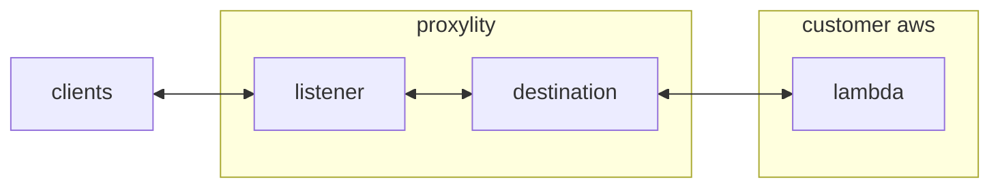

## Packet Counter

This example demonstrates a packet counting UDP endpoint implemented with Proxylity UDP Gateway and AWS Lambda.  Clients sending packets to the endpoint will receive responses containing the quantity of packets received per batch. If a single packet is sent to the endpoint, a single response will be returned with string value `1` as the content.  At higher rates the number in the return packet will increase and it is likely that more than one response will be received due to the multi-region/multi-AZ infrastructure employed by UDP Gateway.

This example demonstrates:

* Using the Proxylity listener custom resource type for CloudFormation.
* Handling batches of UDP packet in AWS Lambda.
* Selectively/conditionally generating responses to packets.

## System Diagram



## Deploying

> **NOTE**: The instructions below assume the `aws` CLI, `jq` and `ncat` are available on your Linux system. 

To deploy the template:

```bash
aws cloudformation deploy \
  --template-file packet-counter.template.json \
  --stack-name packet-counter-example \
  --capabilities CAPABILITY_IAM \
  --region us-west-2
```

Once deployed, the endpoint can be tested with `ncat` and the endpoint information provided in the outputs of the stack. To get the ouputs from the stack and store the salient values in environment variables:

```bash
aws cloudformation describe-stacks \
  --stack-name packet-counter-example \
  --query "Stacks[0].Outputs" \
  --region us-west-2 \
  > outputs.json 

export PACKET_COUNTER_DOMAIN=$(jq -r ".[]|select(.OutputKey==\"Domain\")|.OutputValue" outputs.json)
export PACKET_COUNTER_PORT=$(jq -r ".[]|select(.OutputKey==\"Port\")|.OutputValue" outputs.json)
```

Then to send a single test packet and output the response:

```bash
echo -e Response: $((echo "test" && sleep 2) | ncat -u ${PACKET_COUNTER_DOMAIN} ${PACKET_COUNTER_PORT} -w2)
```

That should elicite output of "Response: 1".

To remove the example stack:
```bash
aws cloudformation delete-stack --stack-name packet-counter-example --region us-west-2
```

## Lambda Implementation

Proxylity forwards packet data to Lambda in JSON format, per the documented [JSON Schema](https://www.proxylity.com/docs/destinations/json-packet-format.html). In this lambda we're interested in a subset of the properties:

```jsonc
{
  "Messages": [
    { 
      "Tag": "",
      "Remote": {
        "IpAddress": "",
        "Port": 0
      },
      // ...
      "Data": "<Base64>"
    },
    // ...
  ]
}
```

The output of the Lambda instructs Proxylity what responses, if any, to send in for each input packet. It's okay to not include all `Tag` values in the output and produce few response, or even none:

```jsonc
{
  "Replies": [
    { 
      "Tag": "",
      // ...
      "Data": "<Base64>"
    },
    // ...
  ]
}
```

The first step in the code is to count the number of packets in the batch that come from the same IP:

```javascript
const counts_by_src = inbound_packets.Messages.reduce((acc, obj) => {
  const src = obj.Remote.IpAddress;
  acc[src] = (acc[src] || 0) + 1;
  return acc;
}, {})
```

The second step is to generate the replies (outbound/response packets), but only send one response per IP.  The code uses a helper function that keeps track of which IPs already have a response by clearing the entry in the map of counts and base64 encoding the response data:

```javascript
function get_and_clear_count_in_b64(map, key) {
  const value = map[key];
  if (value == null) return null;
  map[key] = null;
  return btoa(value.toString() + '\\n');
}
```

The list of response packets is then generated via `map`:

```javascript
const outbound_packets = inbound_packets.Messages.map(function (p) {
  const d = get_and_clear_count_in_b64(counts_by_src, p.Remote.IpAddress);
  if (d == null) return null;
  return {
    GeneratedAt: new Date().toISOString(),
    Tag: p.Tag, 
    Data: d
  }
});
```

And finally, wrapped in the expected `Replies` property to return to Proxylity:

```javascript
return { Replies: outbound_packets };
```
