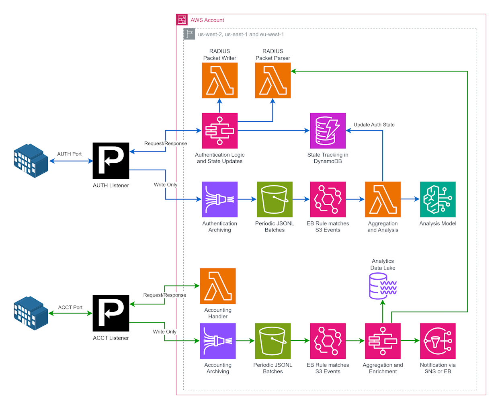

# RADIUS Authorization and Accounting with UDP Gateway

This example demonstrates a cloud-based RADIUS authorization and accounting system using Proxylity's UDP Gateway service. The current implementation provides a foundation with basic packet processing and can be extended to include comprehensive enterprise-class security features.

## Architecture Overview

The system uses two UDP Gateway listeners for RADIUS authentication and accounting, separating the types of packets by port (as is traditional with RADIUS).  Each listener is configured to deliver inbound packets to two destinations: one to generate a response, and the other to archive and process the requests.

The authentication flow handles RADIUS authentication requests using step functions and Kinesis Firehose.  Authenticates requests against DynamoDB records and processes request archives with Bedrock LLM.

The accounting flow handles RADIUS accounting requests using Lambda and Kinesis Firehose. It processes those requests to update per-session packet count and traffic volume aggregates in S3.



## Current Implementation Status

⚠️ **Note**: This is a foundational implementation that provides:
- Basic UDP packet reception, responses and logging via Proxylity UDP Gateway
- Infrastructure framework for RADIUS processing
- Secure data storage and encryption setup
- Multi-region deployment capability

## Components

### Global Resources (`global.template.json`)
- UDP Gateway listeners for authentication and accounting
- CloudWatch Log Group for destination delivery logging (30-day retention)
- IAM roles for Lambda functions and Proxylity service
- Cross-region permissions for multi-region deployment

### Regional Resources (`region.template.json`)

The regional deployment uses a nested template approach. It creates a CloudWatch dashboard for observability, and orchestrates the creation of nested stacks:

**Shared Infrastructure:** (`region-shared.template.json`)
- KMS key and Alias for encryption
- RADIUS packet parser and writer Lambda functions

**Nested Authentication Stack (`region-auth.template.json`):**
- Authentication Lambda function
- DynamoDB table for session state tracking
- CloudWatch log groups and dead letter queues
- IAM policies for authentication services

**Nested Accounting Stack (`region-acct.template.json`):**
- Accounting Lambda function
- CloudWatch log groups and dead letter queues
- IAM policies for accounting services

## Security Features

### Encryption
- **KMS encryption** for all data at rest (DynamoDB and CloudWatch Logs)
- **Customer-managed keys** for enhanced control
- **Automatic key rotation** can be enabled

### Access Control
- **Least privilege IAM policies** with specific resource ARNs

## Deployment

### Prerequisites
1. Active subscription to Proxylity UDP Gateway in AWS Marketplace
2. AWS CLI and SAM CLI configured with appropriate permissions

### Using Automated Scripts (Recommended)
The repository includes deployment scripts for streamlined deployment accross multiple regions:

```bash
# Choose or create deployment buckets (note the extra . to preseve envars)
. ./scripts/prerequisites.sh

# Run deployment script
AWS_REGION=us-west-2 ./deploy.sh
```

### Manual Deployment
For manual deployment or to understand the deployment process in detail, follow these steps:

#### Step 0: Run Checks (Optional)
If your environment has `cfn-lint` installed, you can run `checks.sh` to verify the CloudFormation templates are valid:

```bash
./scripts/checks.sh
```

#### Step 1: Deploy Global Stack
Deploy the global stack that creates the UDP Gateway listeners and IAM roles:

```bash
aws cloudformation deploy \
  --template-file templates/global.template.json \
  --stack-name radius-global \
  --capabilities CAPABILITY_NAMED_IAM \
  --parameter-overrides \
    ClientCidrToAllow="$(curl -s checkip.amazonaws.com)/32"
```

**NOTE:** The snippet above restricts access to the listeners from *only* your current public IP address. If you want to allow access from other sources, update the value of `ClientCidrToAllow` to specify additional CIDR blocks.

Next, capture the outputs of the global stack and transform them into JSON format for consumption by regional stacks using `FnTransform` with `AWS::Include` in the regional stack's `Mappings`, and `Fn::FindInMap` to extract the values needed.

```bash
aws cloudformation describe-stacks \
    --stack-name radius-global \
    --query "Stacks[0]" \
    --output json \
    > radius-global.outputs

jq "[.Outputs[]|{(.OutputKey):.OutputValue}]|add" radius-global.outputs > global-stack-outputs.json
```

#### Step 2: Build and Deploy Regional Stacks
Build the .NET Lambda functions and deploy using SAM:

```bash
# Build the application
sam build --template-file templates/region.template.json

# Deploy to target region (e.g., us-west-2)
sam deploy \
  --stack-name radius-region \
  --s3-bucket <your-deployment-bucket> \
  --capabilities CAPABILITY_IAM CAPABILITY_AUTO_EXPAND \
  --parameter-overrides \
    RadiusLogRetentionDays=90 \
    LambdaLogLevel="INFO"
```

## Configuration Parameters

### Global Template Parameters
- **ClientCidrToAllow**: CIDR block for allowed client IP addresses (default: 0.0.0.0/0)

### Regional Template Parameters
- **RadiusLogRetentionDays**: Log retention period in days (default: 89)
- **AuthStateTableReadCapacity**: DynamoDB read capacity (default: 0 = on-demand)
- **AuthStateTableWriteCapacity**: DynamoDB write capacity (default: 0 = on-demand)
- **LambdaLogLevel**: Log level for Lambda functions (default: INFO)

Note: The regional template retrieves global stack outputs from the JSON file created in Step 1 using the `jq` command above. 

## Monitoring and Observability

### CloudWatch Dashboard
Each regional deployment creates a CloudWatch dashboard with:
- Lambda function metrics (invocations, errors, duration)
- DynamoDB capacity utilization

### Metrics and Alarms
- **Lambda errors**: Automatically tracked with CloudWatch metrics
- **DynamoDB throttling**: Monitor through capacity utilization metrics
- **Dead letter queues**: Monitor message counts for error detection
- **UDP Gateway destinations**: Custom CloudWatch metrics enabled to track packet traffic and error counts

### Current Logging
- **Packet Logging**: Lambda functions log received packet details
- **CloudWatch Logs**: Centralized logging for Lambda and Step Functions executions, and Destination delivery issues

## Current Data Storage

### Authentication State (DynamoDB)
- **Table**: Created by nested authentication stack
- **Encryption**: Customer-managed KMS key
- **Capacity**: Configurable (on-demand by default)

### Request and Log Storage (CloudWatch Logs and S3)
- **Encryption**: Customer-managed KMS key
- **Logs**: Lambda and StepFunctions execution logs are stored in CloudWatch Logs with configurable retention
- **S3**: RADIUS Requests are stored in batches in S3. Parsed content of accounting packets and calculated aggregates as well.

## Scaling Considerations

### Lambda Concurrency
- Default concurrency limits may apply
- Consider reserved concurrency for predictable workloads
- Monitor throttling metrics for performance optimization

### DynamoDB Capacity
- Default configuration uses on-demand capacity for flexible scaling
- Consider provisioned capacity for predictable workloads
- Monitor capacity utilization metrics

### UDP Gateway Limits
- Free plan limits may apply
- Monitor UDP Gateway destination metrics in CloudWatch for packet traffic and error analysis

## Troubleshooting

### Common Issues
1. **Permission Errors**: Verify IAM roles and cross-stack references in global-outputs.json
2. **Lambda Timeouts**: Check function timeout settings and CloudWatch logs
3. **DynamoDB Throttling**: Monitor capacity utilization (on-demand scaling should handle most cases)
4. **Nested Stack Deployment**: Ensure proper SAM CLI setup and S3 bucket permissions
5. **Destination Delivery Failures**: Check the destination logs in CloudWatch for delivery errors

### Debug Resources
- **CloudWatch Logs**: Review function execution logs and packet processing details
- **Destination Logs**: Review UDP Gateway destination delivery logs for troubleshooting
- **CloudWatch Dashboard**: Monitor Lambda and DynamoDB metrics

## Development and Extension

### Building Lambda Functions

**Using SAM (Recommended):**
```bash
# Build all functions using SAM
sam build --template-file templates/region.template.json
```

**Using Make (Individual Functions):**
```bash
# Build authentication Lambda
cd src/radius-auth-lambda
make build-Lambda

# Build accounting Lambda  
cd src/radius-acct-lambda
make build-Lambda
```

### Extending the Implementation
To implement full RADIUS processing:

1. **Add RADIUS Protocol Parsing**: Implement additional RADIUS packet structure parsing needed, if any (e.g. VSAs)
2. **Add Authentication Logic**: Integrate with authentication databases
3. **Add Response Generation**: Generate appropriate RADIUS responses
4. **Add Session Management**: Implement a session state tracking in DynamoDB

## Template Architecture

### Nested Template Structure
```
region.template.json (Parent)
├── region-shared.template.json (Shared Stack)
├── region-auth.template.json (Authentication Stack)
├── region-acct.template.json (Accounting Stack)
└── Shared Dashboard
```

### Template Dependencies
- Parent template creates shared dashboard (depends on nested stack outputs)
- Nested templates reference parent resources via parameters
- Global stack outputs accessed via included JSON mapping

## Security Best Practices

### Network Security
- Restrict ClientCidrToAllow to known networks in global template
- Monitor network access patterns via CloudWatch metrics

### Data Protection
- KMS keys are customer-managed with configurable access policies
- Audit access patterns with CloudTrail (customer responsibility)
- Implement data classification policies as needed

### Support and Enhancement
For questions about extending this implementation, please reach out to [Proxylity Support](mailto:support@proxylity.com).
