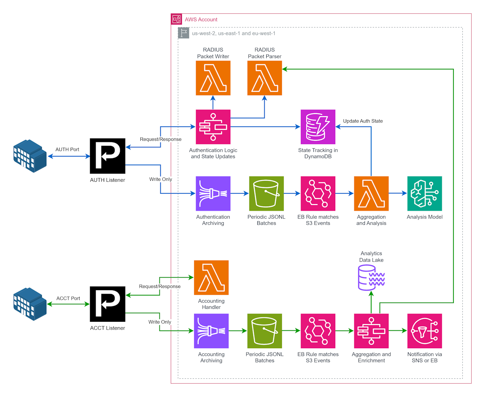

# Serverless RADIUS on AWS

Run serverless RADIUS/wg authentication and accounting on AWS — no EC2, no FreeRADIUS to maintain, no capacity planning. Traffic between your network gear and Proxylity travels inside a WireGuard tunnel, so RADIUS exchanges are encrypted in transit without any additional configuration. Lambda handles everything on the cloud side.

This is a complete, working implementation tested with Unifi guest portals. Running on the Proxylity UDP Gateway platform means it works equally well for a guest network at home as it does for centralizing authentication for a global portfollio of corporate or hospitality properties.

Users and devices are stored in DynamoDB and replicated globally, authentication responses go back to your network gear in real time, and every RADIUS exchange is archived to S3 for compliance and analysis.



## Who This Is For

If you need a RADIUS server for **MAC Authentication Bypass (MAB)**, **PAP**, or **CHAP** — hotspot gateways, captive portals, VPN concentrators, or network gear that authenticates devices by MAC address — this replaces the traditional FreeRADIUS or Windows NPS VM with a fully managed, auto-scaling, multi-region serverless stack deployed from a single `deploy.sh`.

Note: this implementation does not support EAP (PEAP, EAP-TLS, etc.), so it is **not** a drop-in for WPA2-Enterprise or wired 802.1X port authentication, which require EAP tunneling through the NAS.

## What It Does

**Authentication**: Receives Access-Request packets, looks up the user or device in DynamoDB, and returns an Access-Accept or Access-Reject. Supports MAC authentication bypass, PAP, and CHAP. On accept, assigns a VLAN and session timeout from the user or NAS record.

**Accounting**: Receives Accounting-Request packets (Start, Stop, Interim-Update), acknowledges them, and archives the full session history to S3 organized by session ID.

**Anomaly detection**: Auth traffic is periodically analyzed by Bedrock (Nova Lite) to surface unusual authentication patterns — repeated failures from new MACs, unexpected NAS identifiers, or geographic anomalies. Anomaly counts are tracked per calling station, NAS, and source IP in DynamoDB. Once an entity's count reaches the alert threshold an EventBridge event is raised; once it reaches the block threshold, all packets from that entity are silently dropped without any response.

## Deployment

### Prerequisites
- Active subscription to [Proxylity UDP Gateway](https://aws.amazon.com/marketplace) in AWS Marketplace
- AWS CLI and SAM CLI configured with appropriate permissions
- .NET 10 SDK
- `jq`

### Deploy

To control which regions are supported set `DEPLOY_TO_REGIONS` in `scripts/configure.sh` before running `deploy.sh`.  The default is to support `us-west-2`, `us-east-1` and `eu-west-1` with local resources.

```bash
# Deploy global stack + regional stack(s)
AWS_REGION=us-west-2 ./scripts/deploy.sh
```

The deploy script handles the global stack first (listeners and IAM), captures its outputs, then builds and deploys the regional stack with the Lambda functions, DynamoDB table, Kinesis Firehose, and Step Functions state machine. SAM manages its own S3 bucket for deployment artifacts automatically.

### Manual Deployment

#### Step 1: Deploy the Global Stack

```bash
aws cloudformation deploy \
  --template-file templates/global.template.json \
  --stack-name radius-global \
  --capabilities CAPABILITY_NAMED_IAM \
  --parameter-overrides \
    ClientCidrToAllow="$(curl -s checkip.amazonaws.com)/32"
```

`ClientCidrToAllow` restricts which source IPs the UDP Gateway will accept packets from. Set it to your network's egress CIDR(s) — the public IP(s) your access points or VPN concentrator uses to reach the internet.

Capture the global stack outputs for the regional stack:

```bash
aws cloudformation describe-stacks \
    --stack-name radius-global \
    --query "Stacks[0]" \
    --output json \
    > radius-global.outputs

jq "[.Outputs[]|{(.OutputKey):.OutputValue}]|add" radius-global.outputs > global-stack-outputs.json
```

#### Step 2: Build and Deploy Regional Stack

```bash
sam build --template-file templates/region.template.json

sam deploy \
  --stack-name radius-region \
  --resolve-s3 \
  --capabilities CAPABILITY_IAM CAPABILITY_AUTO_EXPAND \
  --parameter-overrides \
    RadiusLogRetentionDays=90 \
    LambdaLogLevel="INFO"
```

## Setting Up Your Network Gear

Proxylity UDP Gateway listeners use WireGuard as the transport — RADIUS packets from your NAS travel inside a WireGuard tunnel rather than as plain UDP across the internet. This means your network gear doesn't talk directly to Proxylity; instead, a WireGuard client on your gateway encapsulates the traffic. The NAS (access point, controller) is configured to send RADIUS to the WireGuard tunnel IP rather than a public internet address, so only that specific traffic routes through the tunnel and everything else continues normally.

After deployment, capture the outputs you'll need:

```bash
aws cloudformation describe-stacks \
  --stack-name radius-global \
  --query "Stacks[0].Outputs" \
  > global-outputs.json

export AUTH_ENDPOINT=$(jq -r '.[]|select(.OutputKey=="AuthEndpoint")|.OutputValue' global-outputs.json)
export ACCT_ENDPOINT=$(jq -r '.[]|select(.OutputKey=="AcctEndpoint")|.OutputValue' global-outputs.json)
export AUTH_WG_KEY=$(jq -r '.[]|select(.OutputKey=="AuthListenerWireGuardPublicKey")|.OutputValue' global-outputs.json)
export ACCT_WG_KEY=$(jq -r '.[]|select(.OutputKey=="AcctListenerWireGuardPublicKey")|.OutputValue' global-outputs.json)
```

The `configure.sh` script generates a WireGuard key pair automatically (`peer_private.key` / `peer_public.key`) during deployment. The public key from that pair is registered with both listeners as `FirstPeerPublicKey`.

To populate users, write records to the DynamoDB `RadiusAuthStateTable` with partition key `USER#{username}`, sort key `#CONFIG`, and include `password`, `vlan`, and optionally `groups`. For MAC authentication bypass the system automatically creates user records from Calling-Station-Id on first successful auth.

### UniFi

The UDM/UDM-Pro acts as the WireGuard client. Configure two VPN client tunnels — one per listener — then point the RADIUS server profile at the tunnel IPs.

**Step 1 — Create the WireGuard tunnel config files**

Auth tunnel (`radius-auth.conf`):
```bash
cat radius-auth.conf << EOF
[Interface]
PrivateKey = $(cat peer_private.key)
Address = 10.10.10.20/32

[Peer]
PublicKey = ${AUTH_WG_KEY}
Endpoint = ${AUTH_ENDPOINT}
AllowedIPs = 10.10.10.21/32
PersistentKeepalive = 25
EOF
```

Acct tunnel (`radius-acct.conf`):
```bash
cat radius-acct.conf << EOF
[Interface]
PrivateKey = $(cat peer_private.key)
Address = 10.10.10.22/32

[Peer]
PublicKey = ${ACCT_WG_KEY}
Endpoint = ${ACCT_ENDPOINT}
AllowedIPs = 10.10.10.23/32
PersistentKeepalive = 25
EOF
```

> `AllowedIPs` scoped to a single `/32` means only packets destined for that tunnel IP are routed through WireGuard — all other traffic (internet, LAN) is unaffected.

**Step 2 — Add the tunnels to the UDM**

1. Go to **Settings > VPN > VPN Client** and select **Add WireGuard Client**
2. Upload `radius-auth.conf` — repeat for `radius-acct.conf`
3. Confirm both show **Connected** status

**Step 3 — Add the RADIUS server profile**

1. Go to **Settings > Networks > RADIUS Servers** and select **Create New**
2. Set the authentication server address to `10.10.10.21` and port to `1812`
3. Set the accounting server address to `10.10.10.23` and port to `1813`
4. Set the shared secret to match `RadiusSharedSecret` (in `radius_shared_secret.txt`)

**MAC Authentication Bypass:**
1. Go to **Settings > WiFi**, select your SSID, and enable **RADIUS MAC Authentication**
2. Set the **MAC Address Format** to `AABBCCDDEEFF` (no separators, uppercase) — this must match the key format in DynamoDB
3. Select the RADIUS profile created above

When a device connects, UniFi sends its MAC address as both username and password. The stack looks up `USER#{MAC}` in DynamoDB; on match it returns an Access-Accept. For VLAN assignment include `vlan`, `tunnel_type` (`13`), and `tunnel_medium_type` (`6`) in the DynamoDB record.

**Hotspot / Captive Portal:**
1. Go to **Settings > WiFi** (or **Settings > Networks** for a whole VLAN), select your SSID, and enable **Hotspot Portal > Captive Portal**
2. Under **Authentication**, choose **RADIUS** and select the profile created above

Guests enter credentials on the captive portal page; UniFi sends them to RADIUS as a PAP Access-Request. Add user records to DynamoDB with a plaintext `password` field.

## Configuration Parameters

| Parameter | Default | Description |
|---|---|---|
| `ClientCidrToAllow` | `0.0.0.0/0` | Source CIDR(s) permitted by the UDP Gateway listeners |
| `RadiusSharedSecret` | *(required)* | RADIUS shared secret — must match what's configured on your NAS |
| `RadiusLogRetentionDays` | `89` | CloudWatch log retention |
| `AuthStateTableReadCapacity` | `0` | DynamoDB read capacity (0 = on-demand) |
| `AuthStateTableWriteCapacity` | `0` | DynamoDB write capacity (0 = on-demand) |
| `AnomalyAlertThreshold` | `2` | Anomaly detections for an entity before an EventBridge alert is raised |
| `AnomalyBlockThreshold` | `5` | Anomaly detections for an entity before it is silently blocked |
| `LambdaLogLevel` | `INFO` | Lambda log verbosity |

## How It's Put Together

The stack is split into a global CloudFormation template (deployed once) and regional SAM templates (deployed per region).

**Global stack** creates the Proxylity UDP Gateway listeners — one for auth (port 1812) and one for accounting (port 1813). Each listener has two destinations: one that invokes the main processing Lambda and one that feeds Kinesis Firehose for archiving. IAM roles for all components are also created here so they can be referenced across regions.

**Regional stacks** are nested:
- `region-shared.template.json` — KMS key, RADIUS parser Lambda, RADIUS writer Lambda
- `region-auth.template.json` — Auth Lambda, Step Functions state machine, DynamoDB table, Firehose → S3, Bedrock aggregation Lambda
- `region-acct.template.json` — Accounting Lambda, Firehose → S3, distributed Step Functions processing for session archiving

**Authentication flow**: Proxylity batches up to 50 auth packets and invokes the Step Functions Express Workflow directly (synchronously) for each batch. The state machine first parses all packets via the parser Lambda, then batch-loads NAS configurations and IP/NAS anomaly records from DynamoDB in a single request, then processes all packets concurrently in an INLINE Map state. Each packet is checked against pre-loaded block status before any per-packet DynamoDB reads, validated for format (MAC/PAP/CHAP), looked up against the user and NAS records, and routed to an Accept or Reject outcome. The writer Lambda constructs and returns the binary response batch.

**Accounting flow**: The accounting Lambda processes packets directly without Step Functions — it validates the request, constructs the Accounting-Response, and returns it. A separate Firehose destination archives all packets; an EventBridge rule triggers a distributed Step Functions map execution to parse and organize them into S3 by session ID.

## Monitoring

Each regional deployment creates a CloudWatch dashboard with Lambda invocations/errors/duration, DynamoDB capacity, and Proxylity destination delivery metrics (packet volume, success/error counts, batch latency).

Log groups:
- `/radius/RadiusAuth/DeliveryLogs` — Proxylity delivery events for the auth destination
- `/radius/RadiusAcct/DeliveryLogs` — Proxylity delivery events for the accounting destination
- `/aws/lambda/{stack-name}-radius-*` — Lambda function execution logs

## Troubleshooting

**Auth requests not getting responses**: Check `/radius/RadiusAuth/DeliveryLogs` first — delivery errors from Proxylity (timeouts, Lambda errors) show up there before CloudWatch Lambda logs.

**Access-Reject for a known user**: The DynamoDB key is `USER#{username}` with sort key `#CONFIG`. Verify the record exists and the `password` attribute matches what the client is sending. For PAP, the password is recovered by XORing the ciphertext against successive MD5 digests of `(shared_secret || authenticator || previous_block)` per RFC 2865 §5.2; make sure `RadiusSharedSecret` matches your NAS config exactly.

**CHAP failures**: The CHAP hash is calculated from the CHAP ID, user password, and CHAP challenge per RFC 2865. Confirm the shared secret and that the NAS is sending a CHAP-Challenge attribute.

**Nested stack deployment errors**: Ensure the `global-stack-outputs.json` file is present and current before deploying the regional stack. The regional templates reference it via `AWS::Include`.
- **Destination Logs**: Review UDP Gateway destination delivery logs for troubleshooting
- **CloudWatch Dashboard**: Monitor Lambda and DynamoDB metrics

## Development and Extension

### Building Lambda Functions

**Using SAM (Recommended):**
```bash
# Build all functions using SAM
sam build --template-file templates/region.template.json
```

**Using Make (Individual Functions):**
```bash
# Build authentication Lambda
cd src/radius-auth-lambda
make build-Lambda

# Build accounting Lambda  
cd src/radius-acct-lambda
make build-Lambda
```

## Template Architecture

### Nested Template Structure
```
region.template.json (Parent)
├── region-shared.template.json (Shared Stack)
├── region-auth.template.json (Authentication Stack)
├── region-acct.template.json (Accounting Stack)
└── Shared Dashboard
```

### Template Dependencies
- Parent template creates shared dashboard (depends on nested stack outputs)
- Nested templates reference parent resources via parameters
- Global stack outputs accessed via included JSON mapping

## Security Model

### RADIUS/UDP over WireGuard is Sound

RADIUS has a reputation for weak transport security, and that reputation is largely earned for bare UDP deployments where packets cross untrusted networks unencrypted. This stack does not do that. Every RADIUS packet travels inside a WireGuard tunnel (ChaCha20-Poly1305 with mutual authentication) before it reaches the internet. RADIUS over WireGuard is the same relationship that exists between HTTP and TLS. Calling PAP or CHAP over WireGuard insecure is like calling HTTPS insecure because TCP has no native encryption.

Within that model:

- **PAP**: The user password is XOR-obfuscated with an MD5 digest of the shared secret and a per-packet authenticator inside the RADIUS packet. Over WireGuard, the outer ChaCha20 encryption is the actual confidentiality mechanism.
- **CHAP**: The password never leaves the client in any form — only an MD5 hash of `(CHAP-ID || password || challenge)` is transmitted. This inner protection holds even if the tunnel were compromised at the RADIUS layer.
- **MAC auth (MAB)**: The MAC address is both username and password. Security here is entirely about whether your NAS is trustworthy, not about the RADIUS exchange.

### BlastRADIUS in Context

[BlastRADIUS (CVE-2024-3596)](https://www.blastradius.fail/) is a real vulnerability and warrants attention. The attack allows an on-path attacker to modify RADIUS Access-Reject responses into Access-Accepts using an MD5 chosen-prefix collision. It requires a MITM position and forged packet delivery within the round-trip window.

For bare UDP RADIUS over untrusted networks, it is a potential issue (though adding a simple `Reply-Message` attribute with unpredictable content to `Access-Reject` packets can mitigate it).

For this stack, the WireGuard tunnel eliminates the on-path attacker precondition entirely. There is no position from which an attacker can observe or inject RADIUS packets between your NAS and Proxylity. As a defense-in-depth measure this stack includes the `Message-Authenticator` attribute on all responses. A per-packet HMAC-MD5 over the full packet makes response forgery infeasible.

### On RADIUS/TLS (RadSec) as an Alternative

RadSec (RFC 6614) wraps RADIUS in TLS/TCP and addresses transport-security. The tradeoffs compared to RADIUS/UDP over WireGuard are real and worth understanding:

- **Connection overhead**: TLS over TCP introduces a handshake before the first authentication can complete. For long-lived NAS connections this is paid once; for environments with frequent reconnections or many short-lived sessions it accumulates.
- **Head-of-line blocking**: TCP delivers packets in order. A dropped packet stalls all subsequent RADIUS exchanges on that connection until it is retransmitted, adding latency. UDP-based transports process each packet independently.
- **Slow start**: TCP congestion control ramps up throughput conservatively after connection establishment. Authentication bursts — common when a power event causes many devices to re-associate simultaneously — can be throttled by TCP slow start at exactly the moment throughput matters most.
- **Stateful connection management**: RadSec requires maintaining persistent TCP connections from each NAS to each RADIUS server. At scale this is a non-trivial operational surface; NAS firmware support and connection lifecycle handling vary significantly across vendors.
- **CPU Requirements**: TLS consumes significantly more CPU time than WireGuard. WireGuard's handshake skips certificate parsing and signature verification entirely; the difference is roughly 10x for the handshake alone, which compounds at authentication burst scale.

WireGuard gives the transport-security properties of TLS (mutual authentication, forward secrecy, encryption) without the TCP specific failure modes and cost.

## Security Best Practices

### Network Security
- Restrict `ClientCidrToAllow` to the specific egress IPs of your NAS devices rather than `0.0.0.0/0`
- Rotate the WireGuard peer key pair and re-register the public key with Proxylity periodically
- Monitor network access patterns via CloudWatch metrics

### Data Protection
- KMS keys are customer-managed with configurable access policies
- Audit access patterns with CloudTrail (customer responsibility)
- Implement data classification policies as needed

## Testing Authentication

### DynamoDB Record Schema

The authentication state machine uses a DynamoDB table with a single-table design. The table uses `PK` (partition key) and `SK` (sort key) with patterns to support different record types.

#### Record Types

| Record Type | PK Pattern | SK Pattern | Description |
|-------------|------------|------------|-------------|
| User | `USER#<username>` | `#CONFIG` | User credentials and configuration |
| NAS | `NAS#<nas_identifier>` | `#CONFIG` | Network Access Server configuration |
| Session | `SESSION#<session_id>` | `<end_timestamp>` | Authentication session records (auto-created) |

#### User Record Attributes

| Attribute | Type | Description |
|-----------|------|-------------|
| `PK` | String | `USER#<username>` - Username or MAC address (lowercase, no separators for MAC) |
| `SK` | String | `#CONFIG` - Fixed value for user configuration records |
| `user_password` | String | Password for PAP auth, or MAC address for MAC auth |
| `vlan` | String | (Optional) VLAN to assign to authenticated user |
| `groups` | String Set | (Optional) Group memberships returned as RADIUS Class attribute |
| `is_mac_auth` | Boolean | (Optional) Indicates if this is a MAC auth record |
| `TTL` | Number | (Optional) Unix timestamp for record expiration |

#### NAS Record Attributes

| Attribute | Type | Description |
|-----------|------|-------------|
| `PK` | String | `NAS#<nas_identifier>` - NAS-Identifier from RADIUS request |
| `SK` | String | `#CONFIG` - Fixed value for NAS configuration records |
| `session_duration` | Number | Session timeout in seconds (default: 3600) |
| `vlan` | String | (Optional) Default VLAN for users authenticating via this NAS |
| `auto_allow_users` | String Set | (Optional) Usernames or `*` to auto-accept without password verification |

### Creating Test Records

This stack creates separate DynamoDB tables in each of the `us-west-2`, `us-east-1` and `eu-west-1` regions.  Depending on where you are in the world, authentication requests may reach any of those regional tables for authentication. So, when you're creating new records be sure to do so in the regional table in the region handling your packets. 

To find your region:

```bash
export RADIUS_REGION=$(echo -e "hello" | nc -u ingress-1.proxylity.com 2061 -w2 | awk '{print $2}')
```

Next, get the DynamoDB table name from your deployed stack:

```bash
# Get the table name from the regional stack outputs (change the --region as needed)
TABLE_NAME=$(aws cloudformation describe-stacks \
  --stack-name radius \
  --query "Stacks[0].Outputs[?OutputKey=='RadiusAuthStateTableName'].OutputValue" \
  --region $RADIUS_REGION \
  --output text)

echo "Table name: $TABLE_NAME"
```

#### Create a PAP/CHAP User Record

Create a user that authenticates with username/password (PAP):

```bash
aws dynamodb put-item \
  --table-name "$TABLE_NAME" \
  --item '{
    "PK": {"S": "USER#testuser"},
    "SK": {"S": "#CONFIG"},
    "user_password": {"S": "testpassword"},
    "vlan": {"S": "100"},
    "groups": {"SS": ["employees", "wifi-users"]}
  }' \
  --region $RADIUS_REGION
```

#### Create a MAC Auth Bypass (MAB) Record

Create a MAC address record for devices that authenticate using their MAC address:

```bash
aws dynamodb put-item \
  --table-name "$TABLE_NAME" \
  --item '{
    "PK": {"S": "USER#aabbccddeeff"},
    "SK": {"S": "#CONFIG"},
    "user_password": {"S": "aabbccddeeff"},
    "is_mac_auth": {"BOOL": true},
    "vlan": {"S": "200"},
    "groups": {"SS": ["iot-devices"]}
  }' \
  --region $RADIUS_REGION
```

**Note:** MAC addresses must be lowercase with no separators (colons, hyphens, or spaces).

#### Create a NAS Configuration Record

Configure a NAS device with custom session duration and auto-allow rules:

```bash
aws dynamodb put-item \
  --table-name "$TABLE_NAME" \
  --item '{
    "PK": {"S": "NAS#my-access-point"},
    "SK": {"S": "#CONFIG"},
    "session_duration": {"N": "7200"},
    "vlan": {"S": "50"},
    "auto_allow_users": {"SS": ["guest", "admin"]}
  }' \
  --region $RADIUS_REGION
```

#### Create a NAS with Wildcard Auto-Allow

Configure a NAS that accepts all users without password verification:

```bash
aws dynamodb put-item \
  --table-name "$TABLE_NAME" \
  --item '{
    "PK": {"S": "NAS#open-access-point"},
    "SK": {"S": "#CONFIG"},
    "session_duration": {"N": "1800"},
    "auto_allow_users": {"SS": ["*"]}
  }' \
  --region $RADIUS_REGION
```

### Verifying Records

List all user records in the table:

```bash
aws dynamodb scan \
  --table-name "$TABLE_NAME" \
  --filter-expression "begins_with(PK, :pk)" \
  --expression-attribute-values '{":pk": {"S": "USER#"}}' \
  --query "Items[*].{PK: PK.S, Password: user_password.S, VLAN: vlan.S}" \
  --region $RADIUS_REGION
```

List all NAS records:

```bash
aws dynamodb scan \
  --table-name "$TABLE_NAME" \
  --filter-expression "begins_with(PK, :pk)" \
  --expression-attribute-values '{":pk": {"S": "NAS#"}}' \
  --query "Items[*].{PK: PK.S, SessionDuration: session_duration.N, AutoAllow: auto_allow_users.SS}" \
  --region $RADIUS_REGION
```

### Deleting Test Records

```bash
# Delete a user record
aws dynamodb delete-item \
  --table-name "$TABLE_NAME" \
  --key '{"PK": {"S": "USER#testuser"}, "SK": {"S": "#CONFIG"}}' \
  --region $RADIUS_REGION

# Delete a NAS record
aws dynamodb delete-item \
  --table-name "$TABLE_NAME" \
  --key '{"PK": {"S": "NAS#my-access-point"}, "SK": {"S": "#CONFIG"}}' \
  --region $RADIUS_REGION
```

### Support and Enhancement
For questions about extending this implementation, please reach out to [Proxylity Support](mailto:support@proxylity.com).
