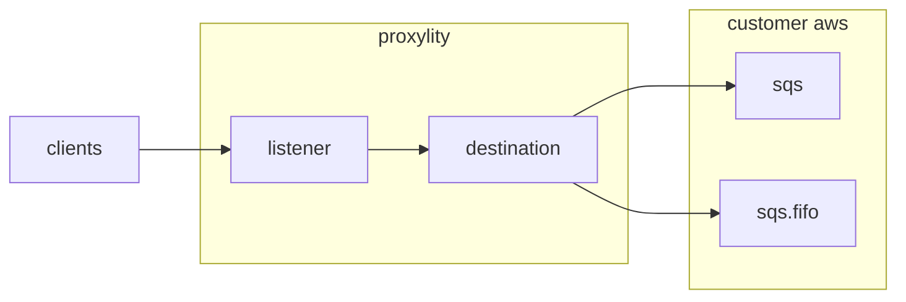

## SQS Queues, Standard and FIFO

This example demonstrates directing UDP packets through Proxylity UDP Gateway to Simple Queue Service (SQS) queues.  Two destinations are configured for the listener, each delivering to a different SQS queue and using different delivery options configured through the Destination's `Arguments` property.

> NOTE: SQS is a write-only Destination service, so no responses will be generated for inbound UDP packets in this example. To generate responses, add another Destination that supports request/response delivery like Lambda, StepFunctions or API Gateway.

This example demonstrates:

* Using the Proxylity listener custom resource type for CloudFormation.
* Multi-plexing batches of UDP packets to two queues (standard and FIFO).
* Configuring SQS delivery options (raw delivery, message attributes, `MessageGroupId`, `MessageDeduplicationId`).

## System Diagram



## Deploying

> **NOTE**: The instructions below assume the `aws` CLI, `jq` and `ncat` are available on your Linux system. 

To deploy the template:

```bash
aws cloudformation deploy \
  --template-file sqs.template.json \
  --stack-name sqs-example \
  --capabilities CAPABILITY_IAM \
  --region us-west-2
```

Once deployed, the endpoint can be tested with `ncat` and the endpoint information provided in the outputs of the stack. To get the ouputs from the stack and store the salient values in environment variables:

```bash
aws cloudformation describe-stacks \
  --stack-name sqs-example \
  --query "Stacks[0].Outputs" \
  --region us-west-2 \
  > outputs.json 

export SQS_DOMAIN=$(jq -r ".[]|select(.OutputKey==\"Domain\")|.OutputValue" outputs.json)
export SQS_PORT=$(jq -r ".[]|select(.OutputKey==\"Port\")|.OutputValue" outputs.json)
export SQS_QUEUE_URL=$(jq -r ".[]|select(.OutputKey==\"QueueUrl\")|.OutputValue" outputs.json)
export SQS_FIFO_QUEUE_URL=$(jq -r ".[]|select(.OutputKey==\"FifoQueueUrl\")|.OutputValue" outputs.json)
```

Then to send a single test packet and output the response:

```bash
echo "test" | ncat -u ${SQS_DOMAIN} ${SQS_PORT}
```

No response will be generated, but we can retrieve the messages using the CLI:
```bash
aws sqs receive-message --queue-url ${SQS_QUEUE_URL} --message-system-attribute-names All --region us-west-2 > queue_message.txt
aws sqs receive-message --queue-url ${SQS_FIFO_QUEUE_URL} --message-system-attribute-names All --region us-west-2 > fifo_queue_message.txt
```

> **NOTE**: For FIFO queues, only one message per `MessageGroupId` can be in-flight (received but not deleted) at a time. If you need to retrieve additional messages from the same group, you must first delete the received message or wait for the visibility timeout to expire.

Each queue should contain the message with the attributes and content appropriate to the queue's configuration:

```bash
cat queue_message.txt fifo_queue_message.txt
```

To remove the example stack:
```bash
aws cloudformation delete-stack --stack-name sqs-example --region us-west-2
```

## SQS Technical Details

Proxylity forwards packet data to SQS per the documented [SQS Destinations](https://www.proxylity.com/docs/destinations/sqs.html) behavior. In this example we've configured both a standard and a FIFO queue with different delivery options.

### Standard Queue Destination

The first destination uses default delivery behavior:
* **Format**: JSON payload containing packet metadata and data
* **Message Attributes**: None (default)
* **Batching**: Up to 10 messages or 1 second timeout

### FIFO Queue Destination

The second destination demonstrates advanced FIFO queue configuration:
* **Format**: Raw payload delivery using UTF-8 encoding (`SendRaw: true`)
* **Message Attributes**: Enabled (`UseMessageAttributes: true`) to include source IP/port, domain, and ingress port metadata
* **MessageGroupId**: Extracted from the first byte of the payload, formatted as hex (`MessageGroupIdExpression: "[0:1]"`, `MessageGroupIdFormatter: "hex"`)
* **MessageDeduplicationId**: Extracted from the remaining payload bytes, base64 encoded (`MessageDeduplicationIdExpression: "[1:]"`, `MessageDeduplicationIdFormatter: "base64"`)

The `MessageDeduplicationId` parameter is required for FIFO queues when `ContentBasedDeduplication` is not enabled. Using the expression-based approach allows you to extract deduplication IDs directly from your UDP packet payloads, giving you full control over message deduplication logic.

Similarly, `MessageGroupId` determines the ordering and processing scope within FIFO queues. Messages with the same group ID are processed in order, and only one message per group can be in-flight at a time. The expression-based extraction demonstrated here allows you to partition your UDP packet stream into logical groups based on payload content.