# Supabase UDP Bridge

Route UDP packets from any device directly into a [Supabase](https://supabase.com/) Edge Function using [Proxylity](https://proxylity.com/) and AWS API Gateway.

A Step Functions Standard Workflow keeps a rotating short-lived JWT in an API Gateway stage variable. A VTL mapping template injects it as the `Authorization` header on every outbound request. The Supabase Edge Function verifies the token and persists each packet to Postgres.


## Architecture

```mermaid
flowchart TD
    device["UDP Device<br/>(any language or platform)"]
    listener["Proxylity UDP Listener<br/>(Formatter: utf8)"]
    apigw["API Gateway REST API<br/>POST /udp-receiver<br/>(AWS_IAM auth)"]
    vtl["VTL Mapping Template<br/>Injects: Authorization: Bearer &#36;{SUPABASE_JWT}"]
    edgefn["Supabase Edge Function<br/>udp-receiver<br/>(Deno / TypeScript)"]
    postgres["Supabase Postgres<br/>udp_messages table"]
    sfn["Step Functions<br/>JWT Refresh Loop<br/>(Standard Workflow)"]
    signer["JwtSigner Lambda<br/>(Node.js 20.x)"]
    ssm["SSM Parameter Store<br/>/supabase-udp/jwt-secret"]

    device  -- "UDP packets" --> listener
    listener -- "POST { Messages: [...] }" --> apigw
    apigw --> vtl
    vtl -- "POST with Authorization header" --> edgefn
    edgefn -- "batch INSERT" --> postgres
    edgefn -- "{ Replies: [...] }" --> apigw
    apigw -- "{ Replies: [...] }" --> listener
    listener -- "UDP reply (ACK)" --> device

    sfn -- "every TTL-buffer seconds" --> signer
    signer -- "GetParameter (WithDecryption)" --> ssm
    signer -- "{ token, waitSeconds }" --> sfn
    sfn -- "apigateway:updateStage<br/>writes SUPABASE_JWT" --> apigw
```



### What happens on each UDP packet

1. A device sends a UDP datagram to the Proxylity listener endpoint.
2. Proxylity batches up to `BatchCount` packets and POSTs `{ "Messages": [...] }` to API Gateway.
3. The VTL request template injects `Authorization: Bearer <SUPABASE_JWT>` (from the stage variable) and passes the body through unchanged.
4. The Edge Function verifies the JWT, decodes each packet's base64 `Data` field, and batch-inserts all rows into `udp_messages`.
5. The Edge Function returns `{ "Replies": [...] }`, which Proxylity delivers back to each device as a UDP reply.

**Zero Lambda invocations on the data path.** The JwtSigner Lambda is only called by Step Functions, on a schedule — not per packet.


## The JWT Refresh Pattern

API Gateway stage variables are a lightweight in-memory store for configuration values that the VTL template can reference per-request. The Step Functions loop exploits this to keep a rotating credential ready without any compute on the hot path:

```
States:
  SignJwt            → Invoke JwtSigner Lambda → { token, waitSeconds }
  UpdateStageVariable → apigateway:updateStage  → writes SUPABASE_JWT stage variable
  WaitForExpiry      → Wait waitSeconds         → (loop)
```

`waitSeconds = TokenTtlSeconds - TokenRefreshBufferSeconds`. The buffer (default 5 minutes) ensures the stage variable is always updated well before the current token expires, absorbing clock skew between the JwtSigner and the Edge Function.

This pattern applies to any third-party API that accepts short-lived JWTs: replace the Edge Function URL and the verification logic, and the AWS infrastructure is identical.


## The Proxylity Batch Contract

All Proxylity destinations that receive batches share the same JSON contract. For API Gateway destinations the body is:

**Request** (Proxylity → API Gateway → Edge Function):
```json
{
  "Messages": [
    {
      "Tag":        "a1b2c3d4",
      "Remote":     { "IpAddress": "203.0.113.5", "Port": 51234 },
      "Local":      { "Domain": "ingress-1",       "Port": 15678 },
      "ReceivedAt": "2026-03-11T14:23:01.412Z",
      "Formatter":  "utf8",
      "Data":       "aGVsbG8="
    }
  ]
}
```

**Response** (Edge Function → API Gateway → Proxylity):
```json
{
  "Replies": [
    {
      "Tag":  "a1b2c3d4",
      "Data": "T0s="
    }
  ]
}
```

`Tag` is the correlation key — each Reply is routed back to the sender of the matching Message. Omit a `Tag` from `Replies` to send no response (normal for fire-and-forget sensor data).

`Data` is always base64-encoded. Use `decodeData()` and `encodeReply()` from `supabase/functions/_shared/proxylity.ts` to work with plain text.

See the [Proxylity packet format reference](https://proxylity.com/docs/destinations/json-packet-format.html) for the full schema.


## Writing Your Own Edge Function

The only Proxylity-aware file in the Supabase project is `supabase/functions/_shared/proxylity.ts`. It contains the TypeScript types (`ProxylityRequest`, `ProxylityResponse`, `RequestPacket`, `ResponsePacket`) and three helpers (`decodeData`, `encodeReply`, `parseBatch`).

Any Edge Function that imports this helper can receive UDP batches from Proxylity:

```typescript
import { parseBatch } from "../_shared/proxylity.ts";

Deno.serve(async (req) => {
  // ... verify JWT ...
  const { messages, reply, build } = await parseBatch(req);
  for (const msg of messages) {
    const text = decodeData(msg);   // your protocol here
    // ... do something with text ...
    reply(msg.Tag, "OK");
  }
  return Response.json(build());    // { Replies: [...] }
});
```

The Edge Function can do anything Deno allows: Postgres inserts, Realtime broadcasts, calls to other Supabase functions, external API calls, AI inference — the contract with Proxylity is only the HTTP request/response shape.


## Repository Structure

```
supabase-udp/
│
├── README.md
├── template.yaml                         # SAM: all AWS infrastructure
├── outputs.json                          # generated by 2-deploy-aws.sh
│
├── supabase/                             # Supabase CLI project root
│   ├── config.toml                       # Function config (verify_jwt = false)
│   ├── migrations/
│   │   └── 20260311000000_init.sql       # CREATE TABLE udp_messages
│   └── functions/
│       ├── _shared/
│       │   └── proxylity.ts              # Shared types + helpers (no dependencies)
│       └── udp-receiver/
│           └── index.ts                  # Edge Function: verify JWT → insert → reply
│
├── src/
│   └── JwtSigner/                        # Node.js 20.x Lambda (no npm dependencies)
│       ├── index.js                      # Signs HS256 JWTs from SSM secret
│       └── package.json
│
└── scripts/
    ├── 1-deploy-supabase.sh              # supabase db push + functions deploy + secrets
    ├── 2-deploy-aws.sh                   # sam build + sam deploy + outputs
    └── 3-start-token-refresh.sh          # start-execution on the SFN state machine
```


## Prerequisites

- An [AWS account](https://aws.amazon.com/) with a [Proxylity UDP Gateway subscription](https://aws.amazon.com/marketplace/pp/prodview-cpvl5wgt2yo2e) (free tier works)
- A [Supabase project](https://database.new) (free tier works)
- AWS CLI configured: `aws configure`
- SAM CLI: `pip install aws-sam-cli`
- Node.js (for the Supabase CLI — no global install required)
- `jq`, `openssl`, `python3`, `nc` (netcat) available in your shell (WSL2 on Windows works)

> **Note:** The scripts assume a Linux/macOS shell (or WSL2 on Windows).


## Deployment

### Step 1 — Install dependencies and link Supabase CLI to your project

```bash
cd supabase-udp
npm install                                         # installs supabase CLI locally — no global install needed
npx supabase login
npx supabase link --project-ref your-project-id     # find the ID in the Supabase dashboard URL
```

### Step 2 — Deploy Supabase assets

```bash
cd supabase-udp
bash scripts/1-deploy-supabase.sh
```

This runs the migration, deploys the Edge Function, generates a random JWT secret, and stores it in Supabase secrets. Copy the two exported values printed at the end.

### Step 3 — Export the values from step 2

```bash
export JWT_SECRET='<printed by step 2>'
export SUPABASE_EDGE_FUNCTION_URL='https://xxxx.supabase.co/functions/v1/udp-receiver'
```

### Step 4 — Deploy the AWS stack

```bash
bash scripts/2-deploy-aws.sh
```

This stores the JWT secret in SSM Parameter Store and deploys the SAM stack. You will be prompted to confirm parameters on the first run; accept all defaults except `SupabaseEdgeFunctionUrl` (set automatically).

### Step 5 — Start the JWT refresh loop

```bash
bash scripts/3-start-token-refresh.sh
```

This starts the Step Functions execution that keeps `SUPABASE_JWT` populated. **Do not send UDP traffic before this step completes.**

### Step 6 — Send a test packet

```bash
# Read ENDPOINT from outputs.json
ENDPOINT=$(python3 -c "import json; o=json.load(open('outputs.json')); print(next(x['OutputValue'] for x in o if x['OutputKey']=='Endpoint'))")
DOMAIN=${ENDPOINT%:*}
PORT=${ENDPOINT##*:}

(echo "hello from device-1" && sleep 2) | nc -u "$DOMAIN" "$PORT" -w2
```

You should receive `OK` back over UDP.

### Step 7 — Verify data in Supabase

Open the [Supabase dashboard](https://supabase.com/dashboard), navigate to your project, and either:

- **Table Editor** → select `udp_messages` to browse rows directly, or
- **SQL Editor** → run:

```sql
SELECT tag, received_at, source_ip, payload
FROM udp_messages
ORDER BY received_at DESC
LIMIT 5;
```


## SAM Template Parameters

| Parameter | Default | Description |
|---|---|---|
| `SupabaseEdgeFunctionUrl` | *(required)* | Full HTTPS URL of the deployed Edge Function |
| `JwtSecretParam` | `/supabase-udp/jwt-secret` | SSM SecureString path for the HS256 signing secret |
| `TokenTtlSeconds` | `3600` | JWT lifetime in seconds |
| `TokenRefreshBufferSeconds` | `300` | Seconds before expiry to refresh |
| `BatchCount` | `25` | Max UDP packets per API Gateway invocation |
| `BatchTimeoutSeconds` | `0.05` | Max seconds Proxylity waits to fill a batch |
| `ClientCidrToAllow` | `0.0.0.0/0` | IP allowlist for the UDP listener |


## Testing

### Test JWT expiry and refresh

Deploy with `TokenTtlSeconds=120` and `TokenRefreshBufferSeconds=30`. Watch the Step Functions execution in the AWS console — you should see the loop cycle approximately every 90 seconds. Send packets continuously and verify that no rows are dropped across a refresh boundary.

### Test expired JWT rejection

Temporarily blank the stage variable and verify that packets produce no rows:
```bash
aws apigateway update-stage \
  --rest-api-id $(python3 -c "import json; o=json.load(open('outputs.json')); print(next(x['OutputValue'] for x in o if x['OutputKey']=='SupabaseApiId'))") \
  --stage-name prod \
  --patch-operations '[{"op":"replace","path":"/variables/SUPABASE_JWT","value":"invalid"}]'
```

Send a packet — the Edge Function returns 401, API Gateway maps it to `{"Replies":[]}`, and no rows appear in `udp_messages`. Restart the Step Functions execution to restore normal operation.

### Test batch integrity

Send 50 packets in quick succession and verify that all 50 rows appear in the table:
```bash
for i in $(seq 1 50); do echo "device-1 reading-$i" | nc -u "$DOMAIN" "$PORT"; done
```

Then in the Supabase dashboard SQL Editor:

```sql
SELECT COUNT(*) FROM udp_messages
WHERE received_at > now() - interval '30 seconds';
```


## Going Further

- **Realtime dashboard** — Add a `supabase.channel('sensors').send(...)` call in the Edge Function to broadcast live readings to a browser dashboard without polling.
- **Typed device protocol** — Replace the raw `payload` column with typed fields (e.g. `device_id TEXT`, `temperature FLOAT8`) and parse them from `decodeData(msg)` in the Edge Function.
- **Row-level security** — Map `source_ip` to a Supabase Auth user to let devices own their own rows, enabling secure per-device dashboard queries.
- **WireGuard listener** — Add a second Proxylity WireGuard listener pointing at the same API Gateway resource. The Lambda receives identical payloads either way (`DecapsulatedDelivery: true` strips the tunnel; the Edge Function is transport-agnostic).
- **Multiple Edge Functions** — Deploy distinct functions (e.g. `udp-alerts`, `udp-analytics`) by adding more Proxylity listeners and API Gateway resources in `template.yaml`. Each function imports `_shared/proxylity.ts` and handles its own logic independently.


## Cleanup

```bash
# Stop the JWT refresh execution
EXEC_ARN=$(aws stepfunctions list-executions \
  --state-machine-arn $(python3 -c "import json; o=json.load(open('outputs.json')); print(next(x['OutputValue'] for x in o if x['OutputKey']=='JwtRefreshStateMachineArn'))") \
  --status-filter RUNNING --query 'executions[0].executionArn' --output text)
aws stepfunctions stop-execution --execution-arn "$EXEC_ARN"

# Delete the AWS stack
sam delete --stack-name supabase-udp

# Delete the SSM parameter
aws ssm delete-parameter --name /supabase-udp/jwt-secret

# Remove Supabase assets
npx supabase functions delete udp-receiver
# Drop the table: Supabase dashboard → SQL Editor → DROP TABLE udp_messages;
```
