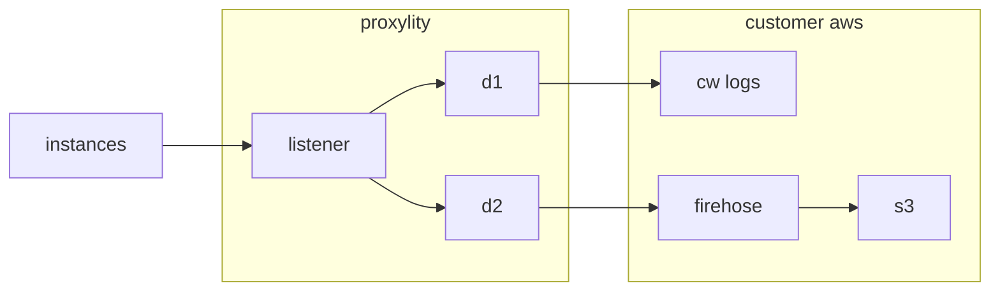

## SYSLOG to CloudWatch with S3 Archive

> **Note:** Log records are generally free from sensitive information, however before configuring a public endpoint please consider the risk. 

This template demonstrates a logging endpoint using Proxylity UDP Gateway, CloudWatch, Kinesis Firehose and S3. Systems and devices can be configured to send SYSLOG records (on Linux see `/etc/syslog.conf`) to the endpoint found the in stack outputs. For transient environments (developer, PoC, and similar) being able to provision and deprovision dedicated logging quickly means fewer dependencies, less coupling and less comingling of data -- all helpful in speeding delivery. 

The architecture has the advantages of being:

1. Quick and easy to provision and de-provision.
2. Scales to zero, allowing for multiple stacks/environments to support branch and PR test automation and CI.
3. Scales up effortlessly, never running out of storage.
4. Adds no maintenance (updates, upgrades, patching, etc.) to your backlog.
5. Compliance oriented encryption of log data with customer managed key, configurable message retention perdiods in CloudWatch and S3, and SSL-only access.

## System Diagram



## Deploying

The instructions below assume the `aws` CLI and `jq` are available on your system. 

To deploy the template:

```bash
aws cloudformation deploy \
  --template-file syslog-cw-s3.template.json \
  --stack-name syslog-example \
  --capabilities CAPABILITY_IAM \
  --region us-west-2

aws cloudformation describe-stacks \
  --stack-name syslog-example \
  --query "Stacks[0].Outputs" \
   --region us-west-2 \
  > outputs.json 

export SYSLOG_DOMAIN=$(jq -r ".[]|select(.OutputKey==\"Domain\")|.OutputValue" outputs.json)
export SYSLOG_PORT=$(jq -r ".[]|select(.OutputKey==\"Port\")|.OutputValue" outputs.json)
```

Once deployed, the endpoint can be tested by sending messages manually via `ncat` or by configuring one or more Linux systems by editing the `/etc/syslog.conf` to include an entry directing logs to the newly created endpoint:

> **Note:** Again, please be aware that sending system logs over plain UDP includes risk.  This example is for demonstration purposes only.

```bash
echo "*.* @${SYSLOG_DOMAIN}:${SYSLOG_PORT}" | sudo tee -a /etc/syslog.conf
sudo service rsyslog restart 
```

Listing the S3 bucket objects and log/log events verifies messages sent to the Listener are being delivered:

```bash
export SYSLOG_BUCKET=$(jq -r ".[]|select(.OutputKey==\"BucketName\")|.OutputValue" outputs.json)
export SYSLOG_LOGGROUP=$(jq -r ".[]|select(.OutputKey==\"LogGroupName\")|.OutputValue" outputs.json)

aws s3 ls --recursive --bucket-name ${SYSLOG_BUCKET} --region us-west-2
aws logs filter-log-events --log-group-name ${SYSLOG_LOGGROUP} --query "events[].message"  --region us-west-2
```

To remove the syslog configuration, manually remove the line from the end of `/etc/syslog.conf`:

```bash
sudo nano /etc/syslog.conf
```

To remove the example stack from your AWS account, you'll first need to empty the S3 bucket it creates:

> **CAUTION**: This command removes everything from the bucket!  
```bash
read -p "Are you sure you want to delete ALL contents of the bucket '${SYSLOG_BUCKET}'? " -n 1 -r; echo; if [[ $REPLY =~ ^[Yy]$ ]]; then aws s3 rm s3://${SYSLOG_BUCKET} --recursive --region us-west-2; fi
```

Once that's done, the stack can be deleted with:

```bash
aws cloudformation delete-stack --stack-name syslog-example --region us-west-2
```
