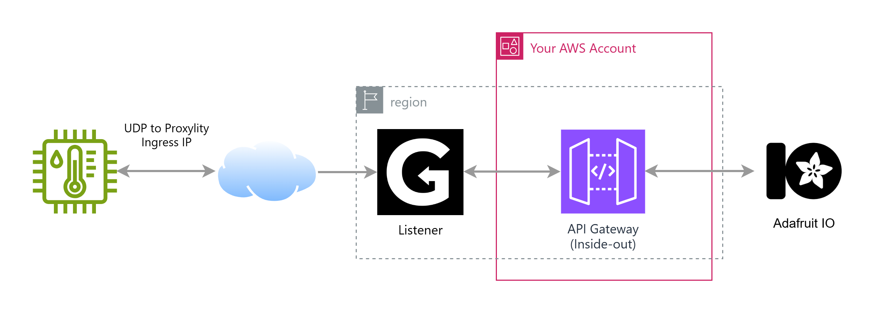

## UDP to HTTP with API Gateway

This example uses UDP Gateway's integration with AWS API Gateway to bridge UDP traffic to an external REST API.  For the sake of this example, we're using [Adafruit's excellent IO service](https://io.adafruit.com). True to our values, we've gone "Functionless" with this example. No Lambda is needed, or even a StepFunctions state machine -- UDP is delivered directly to an "inside out" AWS API Gateway resource that proxies out to the Adafruit API without any code required.  This is a powerful architecture that can scale to very large systems.

This example demonstrates:

* Using the Proxylity UDP Gateway custom CloudFormation resources.
* Configuring a Destination with region-specific destination ARNs for performance and resilience.
* Configuring an IAM role for Proxylity that allows calling only specific external APIs on the API Gateway.
* Transforming UDP packet data to send to multiple Adafruit feeds via a single API endpoint.

## System Diagram

In the diagram below the remote sensor is sending UDP packets containing temperature and humidity readings formatted as strings to a UDP Gateway Listener ingress endpoint IP and port. The Listener has a single Destination with an `execute-api` Destination ARN which specifies the stage, path and method to invoke on the API for each batch of packets. The API Gateway HTTP integration includes Velocity Template Language (VTL) templates for transforming the UDP packet payloads to data points in the JSON format required by Adafruit IO. If sending the data points is successful, a reply with "SUCCESS" is returned to the device, otherwise a response with "FAILURE" is in the reply.



We're using the Adafruit IO "Create Group Data" endpoint, transforming a batch of UDP packets to a set of feed data points using VTL, but be aware the rate limits still apply so keep that in mind!

## Deploying

> **NOTE**: The instructions below assume the `aws` CLI, `jq` and `ncat` are available on your Linux system (under Windows, WSL2 works great). 

First we create the stack. The template includes the Proxylity Listener and Destination, IAM Role used by Proxylity and API Gateway resources. Before deploying, you'll need:

* An account with [Adafruit IO](https://io.adafruit.com)
* Your API key available
* Two feeds created under the same group to receive the temperature and humidity data

With those prerequisites you can then deploy the template:

```bash
aws cloudformation deploy \
  --template-file udp-to-http.template.json \
  --stack-name udp-to-http-example \
  --capabilities CAPABILITY_IAM \
  --parameter-overrides \
    "AdafruitUsername=your-adafruitio-user-name" \
    "AdafruitAioKey=your-adafruitio-api-key" \
    "AdafruitTemperatureFeedKey=your-temp-feed-key" \
    "AdafruitHumidityFeedKey=your-humidity-feed-key" \
  --region us-west-2
```

We'll need the endpoint information, which we can get from the stack outputs and set in environment variables for convenience:

```bash
aws cloudformation describe-stacks \
  --stack-name udp-to-http-example \
  --query "Stacks[0].Outputs" \
  --region us-west-2 \
  > outputs.json 

export UDP2HTTP_DOMAIN=$(jq -r ".[]|select(.OutputKey==\"Domain\")|.OutputValue" outputs.json)
export UDP2HTTP_PORT=$(jq -r ".[]|select(.OutputKey==\"Port\")|.OutputValue" outputs.json)
```

Once the stack is created the functionality can be tested using `ncat` to send a single test packet and then output the response:

```bash
echo -e Response: $((echo "device-a 72.0 42" && sleep 2) | ncat -u ${UDP2HTTP_DOMAIN} ${UDP2HTTP_PORT} -w2)
```

The packet format is: `device-id temperature humidity` (e.g., "device-a 72.0 42" sends temperature 72.0°F and humidity 42%).

That should elicit the output "SUCCESS" if everything is working correctly. Over at Adafruit you should be able to see the data points in your feeds and dashboards.

To clean up, remove the stack:
```bash
aws cloudformation delete-stack --stack-name udp-to-http-example --region us-west-2
```

## About this Example

As with all our integrations, we use AWS IAM Role assumption to access the destination resource.  In this example the API Gateway requires IAM authentication and the role assigned to the destination has a least-privilege policy that allows invoking the POST method.  This approach means UDP Gateway can only use the API method required, and no others on the Gateway. As a solution like this scales-up to more destinations and external API integrations, so does this security architecture -- destinations are only able to make external requests as your IAM policies allow.

If you have an IoT device—or millions of them—sending sensor data over UDP, this example can be modified to work with it and facilitate integration with a huge variety of backends (Zapier, Slack -- you name it). Why? UDP is a lighter-weight protocol that can be used on tiny, inexpensive remote sensors and keeps the bandwidth use to a bare minimum (satellite connectivity is still expensive). Using UDP Gateway those UDP packets can easily be proxied to AWS services or external services like Adafruit IO. It's a sweet, highly scalable and easy to maintain approach. 

The simplicity of this example highlights the sublime benefits of "Functionless" architecture. Directly integrating services without custom runtime code mean super-low maintenance, and super-robust performance. With "pay for use" and free tiers, it also means very inexpensive deployments and operation.  If you haven't read-up on Functionless, it might be something to explore.
