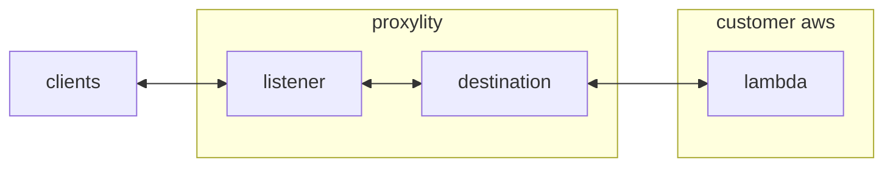

## WireGuard Echo and Ping

This example shows how traffic to UDP Gateway can be protected with the modern, strong encryption provided by WireGuard. It demonstrates how to create a WireGuard protocol Listener and implement a Lambda destination using the [UDP Gateway Lambda SDK for .Net](https://github.com/proxylity/lambda-sdk-net), including using Ahead of Time (AoT) compilation and source generation for JSON serialization (for highest performance and minimal cold starts).

When a WireGuard listener is created, UDP Gateway automatically generates a private key and keeps it as an internal secret. The derived public key is returned as a template output (see the [template](./wireguard.template.json)), which can be used to configure your client applications/networks. Peers are configured as a part of the Listener resource and can be managed as any other Infrastructure as Code.

In this example all tunneled IP traffic is handled by the Lambda (not just UDP). This example implements ICMP ping and UDP echo, showing the fine-grained control available with WireGaurd protected services on UDP Gateway. General "VPN like" capabilities can be acheived by placing a lambda on a VPC and developing a Lambda that acts as a router for the traffic. 

The walk-through below demonstrates deploying this example and testing it using `wg-quick` and `ncat`.

This example demonstrates:

* Using the Proxylity listener custom resource type for CloudFormation to create a WireGuard endpoint.
* Handling batches of decapsulated UDP and ICMP packets in AWS Lambda.
* Optimizing Lambda performance with AoT/native compilation and code generation.

## System Diagram



## Deploying

> **NOTE**: The instructions below assume the `aws` and `sam` CLIs, `ncat` and `wireguard` are available on your Linux system (WSL2 under Windows works great). 

The example configuration includes two peers, so before getting started we can use the `wg` command line to generate a couple new key.  These will also be used for setting up wireguard endpoints later:

```bash
# Generate WireGuard key pairs
wg genkey > proxylity1 && wg pubkey < proxylity1 > proxylity1.pub
wg genkey > proxylity2 && wg pubkey < proxylity2 > proxylity2.pub

# Set environment variables for deployment
export PEER1_PUBLIC_KEY=$(cat proxylity1.pub)
export PEER2_PUBLIC_KEY=$(cat proxylity2.pub)
```

> **SECURITY**: Even though they are generated just for this example, keep your private key files (`proxylity1`, `proxylity2`) secure and never commit them to version control.

To build and deploy the template:

```bash
sam build --template-file wireguard.template.json
sam deploy \
  --stack-name wireguard-example \
  --parameter-overrides \
  Peer1PublicKey=$PEER1_PUBLIC_KEY \
  Peer2PublicKey=$PEER2_PUBLIC_KEY \
  --region us-west-2
  ```

Once deployed, we need to grab the domain, port and public key of the listener to configure wireguard (they should be visiable in the output of sam deploy).

### Example WireGuard Client Configuration

Create a file like `proxylity1.conf`:
```ini
[Interface]
PrivateKey = <contents of proxylity1 file>
Address = 10.10.10.2/24

[Peer]
PublicKey = <listener public key from stack outputs>
AllowedIPs = 10.10.10.0/24
Endpoint = <domain>:<port>
PersistentKeepalive = 25
```

Then to send test packets and display the response (`ncat` will send anything you type through the WireGuard tunnel to the Listener, which will decapsulate it and deliver the inner packet to the lambda function, which will respond with an elaborate echo):

```bash
ncat 10.10.10.10 1010 -u
```

Typing "hello" should elicit a response like "hi 10.10.10.2:51820! Your message \"hello\" for 10.10.10.10:1010 has been received."

The endpoint can also be tested with `ping` since ICMP echo has been implemented as well:

```bash
ping 10.10.10.10
```

Note the round-trip response time will be higher than direct pings due to the batching configuration and secondarily the overhead of calling Lambda.

To decomission the example, remove the wireguard peer from your configuration and delete the stack:
```bash
aws cloudformation delete-stack --stack-name wireguard-example --region us-west-2
```

## Lambda Implementation

The Lambda function in this example demonstrates the core patterns for building high-performance UDP Gateway destinations using the [UDP Gateway Lambda SDK for .Net](https://github.com/proxylity/lambda-sdk-net). The implementation showcases three key delivery models and advanced optimization techniques.

### Core Implementation Files

**Function.cs** - Contains the main Lambda function class that implements the UDP Gateway destination interface. This class demonstrates the decapsulated handler pattern specifically designed for WireGuard listeners, where the Lambda receives already-decrypted UDP packets along with their original source and destination information.

**Handler.cs** - Implements the packet processing logic using the `IDecapsulatedHandler` interface from the UDP Gateway SDK. This handler receives batches of UDP packets that have been decapsulated by the WireGuard listener, processes them, and returns responses that will be re-encapsulated and sent back through the tunnel.

### Delivery Models

The UDP Gateway SDK supports three delivery models for Lambda destinations:

1. **Plain Handlers** - Standard Lambda functions that receive raw UDP packet data
2. **Async Handlers** - Asynchronous processing for scenarios involving asynchronous operations (e.g. I/O)  
3. **Decapsulated Handlers** - Specialized handlers (used in this example) that receive pre-processed packets from protocol listeners like WireGuard, including source/destination metadata

The decapsulated handler pattern is particularly powerful because it abstracts away the complexity of protocol handling while providing access to the original packet context.

### Ahead of Time (AoT) Compilation

This example leverages .NET's Native AoT compilation to achieve exceptional performance:

- **Cold start times**: ~100ms (vs ~1 second with traditional .NET Lambda)
- **Execution times**: <2ms for typical packet processing
- **Memory efficiency**: Reduced memory footprint and faster garbage collection

The performance gains come from pre-compiling the application to native machine code, eliminating the need for JIT compilation at runtime.

### AoT Implementation Details

**Main.cs** - Configures the Lambda runtime for AoT execution using `LambdaBootstrapBuilder` instead of the traditional Lambda host. This file also sets up source-generated JSON serialization contexts required for AoT compatibility.

**Source-Generated JSON Serialization** - Since AoT compilation doesn't support reflection, the example uses `System.Text.Json` source generators to pre-generate serialization code at compile time. This is configured through `JsonSerializerContext` attributes and requires careful planning of all types that need serialization.

**Makefile-based Builds** - The project uses a Makefile to orchestrate the AoT compilation process, which produces a single `bootstrap` executable that serves as the Lambda entry point. This approach provides fine-grained control over the compilation process and ensures consistent builds across environments.

### Performance Considerations

While AoT compilation provides significant performance benefits, it requires:

- **Static analysis compatibility** - All code paths must be determinable at compile time
- **Source-generated serialization** - No runtime reflection for JSON processing
- **Careful dependency management** - All referenced libraries must support AoT compilation

For UDP Gateway destinations handling high packet volumes or requiring minimal latency, these trade-offs are typically worthwhile for the dramatic performance improvements.

## Prerequisites

- AWS CLI configured with appropriate permissions
- AWS SAM CLI
- WireGuard tools (`wg` command)
- netcat (`ncat`)
- Active Proxylity UDP Gateway subscription

---

WireGuard&reg; is a registered trademark of Jason A. Donenfeld. UDP Gateway&trade; is a trademark of Proxylity LLC.
